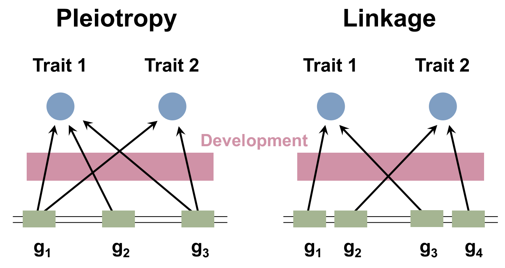

```{r setup, include=FALSE}
knitr::opts_chunk$set(echo = TRUE)
```

```{r libraries,warning=FALSE,message=FALSE}
library(tidyverse)
library(MCMCglmm)
library(MasterBayes)
library(plyr)
library(rgl)
library(MASS)
library(car)
library(akima)
library(OUwie)
library(corHMM)
library(phytools)
library(geiger)
library(ape)
library(nlme)
library(bayou)
```

# Monday June 10 2019
## Lecture 1.1: Introductions
FHL is a land and marine preserve, part of UW.

Low tides Friday/Saturday morning

27 total students, 10ish instructors

### Steve Arnold
We are going to start at a micro level, but then we will expand out so we can integrate and look at deep evolutionary time.

Currently writing "Phenotypic Evolution", argues how field of quantative genetics will help us understand adaptive ??

Steve's lectures will have PDF presentation, the PPT presentation (with notes), lecture notes (essentially the chapters of a book he is writing) and readings relevant to the lecture.

### Joe Felsenstein: the history of quantitative genetics and the basic model to keep in mind
Late 1800s Galton and Pearson both tried to do quantitative theories of quant./discrete characters (prior to rediscovery of Mendel's work). They were crucial for development of statistical methods. They were also the founders of the eugenetics movements.... so there's that.

Standard quantitative genetic model: apply the effects of all relevant genes and then apply the environmental effect

## Lecture 1.2: Molecular quantitative genetics (Patrick Phillips)
Early split between molecular and quantitative genetics, fundamental distinction is what the fundamental genetic unit is. Molecular genetics uses the locus as the smallest unit. Quantitative genetics considers the allele to be the fundamental unit. This allows for considering the different effects of different alleles, including how strong the effects are.

Examples:
- Pleiotropy:
    - mol-bio: property of locus, is or is not
    - quant-gen: property of allele, can be variable btw and within loci and can evolve.
- Epistasis:
    - mol-bio: mutation at one locus blocks effects of mutation at another
    - quant-gen: many possible types of interaction
    
Multivariate selection: $\Delta\bar{z}=G\beta$

Evolution of genetic architecture:
- Pleiotropy: alleles affect multiple traits (Edinborough School)
- Linkage: alleles/genes tend to be inherited together (Birmingham School)



These matter b/c if you select for one trait, you can pull a second trait along with it.

Evolution of the G matrix: 

Finding the allele that matters

## Lecture 1.3: Inheritance of a single trait and response to selection (Steve Arnold)
Probably massively redundant, but that's good b/c it's a fire hose.

Most traits are influenced by many genes, and we can model these traits with a statistical approach. This is not a new concept, Fischer was thinking about this in 1918. Additive genetic variance is the statistical concept that allows us to model inheritance and response to selection.

### Phenotypic resemblance
Looking at offspring as a function of parents.

### Model
$z$ is the phenotype, $x$ is the additive genetic effect and $e$ is the environmental effect.

Phenotypic value: $z = x + e$

Phenotypic mean: $\bar{z} = \bar{x} + \bar{e}$

Phenotypic variance: $ P = G + E$

$G$ is the additive genetic variance which is the key statistical property responsible for Galton's regression

To move beyond parents and offspring we need to include dominance ($d$) and epistasis ($i$) in addition to the additive effects ($x$)

### Examples
Mother-daughter relationship in vertebral counts in garter snakes

### Why don't we run out of additive genetic variance?
Why don't we just lose genetic variance if under a stabilizing pressure? Mutation!

### Changing the trait mean with selection
- Response to selection as a regression problem
- response to selection in a finite population
- response to long term selection

### Conclusions
- G is the key to understanding resemblance
- G is the key to modeling response to selection
- G is nibbled away by selection and restored by mutation

## Exercise 1.1: Estimation of heritability by parent-offspring regression in R

**Part 1 Get the data file**
#Modify the setwd line below so that it points to the folder you choose
#Make sure the data txt file is in that folder

```{r exercise1.1.a}
file_path <- "data/R_inland_snake_data.txt"
thamnophis = read.table(file_path,header=TRUE)
attach(thamnophis)
head(thamnophis)
```

**Part 2 Create a list of family names, no repeats**

```{r exercise1.1.b}
family.list=unique(family)
family.list
#The length of family.list is
length(family.list)
```

**Part 3 Use family.list to calculate h2 and plot**

```{r exercise1.1.c}
moms=NULL
kids=NULL
for (i in family.list){ 
  byfam=subset(body,family==i) 
  #Create a vector of body vertebrae counts for family i
  moms=rbind(moms,byfam[1]) 
  #Save the moms count as the next element in the vector "moms"
  kids=rbind(kids,mean(byfam[-1], na.rm=TRUE)) 
  #Save the mean of the kids count as the next element in the vector "kids" (you are excluding the 1st element of the vector, which is the mom)
}

#Linear regression of kids on moms, will save a bunch of stuff in ls; to see the summary statistics run "summary(ls)", we especially want the slope, which is stored in ls$coefficients
ls=lsfit(moms,kids) 
par(mar = rep(2, 4))
plot(moms, kids, col='blue', pch=19, cex=1.5)

#Extract the 2nd coefficient from the object "coefficients" in "ls"
slope=ls$coefficients[2] 
abline(ls, lwd=5)
#the heritability estimate is twice the slope because we are using just one parent, not both
h.squared=2*slope
h.squared
```

**Part 4 Make a function called h2 that will estimate heritability**

```{r exercise1.1.d}
h2=function(V){
  family.list=unique(family)
  moms=NULL
  kids=NULL
  for (i in family.list){
    byfam=subset(V, family==i) 
    moms=rbind(moms, byfam[1]) 
    kids=rbind(kids, mean(byfam[-1], na.rm=TRUE)) 
  }
  plot(moms, kids, col='blue', pch=19, cex=1.5)
  ls=lsfit(moms, kids)
  abline(ls, lwd=5)
  
  slope=ls$coeff[2]
  h.squared=2*slope

  print('Point estimate of heritability is')
  h.squared
}
print('Point estimate of heritability is')
h.squared
```

**Test out the function on 3 traits by making point estimates of heritability**

```{r exercise1.1.e}
h2(body)
h2(ilab)
h2(tail)
```

**Part 5 Here is some script that will compute and plot a bootstrap sample for the estimate of hertitability for "body"**

**Do NOT run the script below.  Instead, copy and paste it into the Console**
```{r exercise1.1.f,include=FALSE}
family.list=unique(family)
h2.all=NULL
for (j in 1:1000){
  moms=NULL
  kids=NULL
  family.list.boot=sample(family.list,replace=TRUE)
  for (i in family.list.boot){
    byfam=subset(body,family==i) 
    moms=rbind(moms,byfam[1]) 
    kids=rbind(kids,mean(byfam[-1],na.rm=TRUE))
  }
  
  ls=lsfit(moms, kids)
  slope=ls$coeff[2]
  h.squared=2*slope
  #Save the heritability of replicate i as the ith element in vector h2.all
  h2.all=rbind(h2.all,h.squared)  
  #Graph showing the variation in points sampled
  plot(moms,kids,xlim=c(150,180),ylim=c(150,180)) 
  #Superimpose on that graph the regression ls
  abline(ls$coefficients)
  Sys.sleep(0.05)
}
```
#The overlay plots give a visual impression of a nonzero slope

# Now plot a histogram of the bootstrap heritability estimates
```{r exercise1.1.g}
hist(h2.all)
#What does this histogram tell us?
```

## Lecture 1.4: Multivariate inheritance and response to selection (Steve Arnold)
We can expand the G statistic into a G matrix to observe multiple traits simultaneously.

Traits can run together in families.

So what's the model for multivariate resemblance?

Phenotypic value: $z = x + e = \begin{bmatrix} z_1\\ z_2\end{bmatrix} = \begin{bmatrix} x_1\\ x_2\end{bmatrix} + \begin{bmatrix} e_1\\ e_2\end{bmatrix}$

Phenotypic mean: $\bar{z} = \bar{x} + \bar{e} = \begin{bmatrix} \bar{z_1}\\ \bar{z_2}\end{bmatrix} = \begin{bmatrix} \bar{x_1}\\ \bar{x_2}\end{bmatrix} + \begin{bmatrix} \bar{e_1}\\ \bar{e_2}\end{bmatrix}$

Phenotypic variance/covariance: $P = G + E = \begin{bmatrix} P_{11} & P_{12}\\P_{12} & P_{22}\end{bmatrix} = \begin{bmatrix} G_{11} & G_{12}\\G_{12} & G_{22}\end{bmatrix} + \begin{bmatrix} E_{11} & E_{12}\\E_{12} & E_{22}\end{bmatrix}$

The G matrix describes the cloud of genetic values. 
We can consider this via principal components (or eigenvectors). 
The first principal component has the most genetic variance. 
The second principal component is orthogonal to the first.

The genetic correlation is $r_g = G_{12}/\sqrt{G_{11}}G_{22}$


## Exercise 1.2: multivariate inheritance
### Tutorial 1: Matrix algebra session
You will need to install some packages (MASS, car, rgl) if you have not already done so. Find the Packages tab in the bottom right and use the dialog box

Start with the addition of two vectors. The first and third statements define the two vectors

Notice that R treats vectors as 1 column or 1 row matrices
```{r exercise 1.2.t1.a}
a=matrix(data=c(2,3),nrow=2,ncol=1)
a

e=matrix(data=c(3,4),nrow=2,ncol=1)
e
```

Now add the two vectors
```{r exercise 1.2.t1.a2}
z=a+e
z
```

Now try matrix addition.  We begin by defining the two matrices that we will add.
```{r exercise 1.2.t1.b}
G=matrix(data=c(2,3,3,8),nrow=2,ncol=2)
G

E=matrix(data=c(1,2,2,5),nrow=2,ncol=2)
E
```

Add the two matrices, we get
```{r exercise 1.2.t1.c}
P=G+E
P
```

Next, multiply a matrix by a vector.  The following exercise computes the response to directional selection on two traits, given the G-matrix and a vector of selection gradients.
```{r exercise 1.2.t1.d}
beta=matrix(data=c(0.2,0.4),nrow=2,ncol=1)
beta
```

The response to selection is
```{r exercise 1.2.t1.e}
deltazbar=G %*% beta
deltazbar
```

Now, the multiplication of two matrices.  Here we depart from the sequence in the Arnold 1994 Appendix.  We will compute the inverse of a matrix and see if the product of a matrix and its inverse yields the identity matrix.
```{r exercise 1.2.t1.f}
Ginverse=solve(G)
Ginverse
```

```{r exercise 1.2.t1.g}
G %*% Ginverse
```

Finally, solve for the eigenvalues and eigenvectors of the G-matrix.  

What does the output mean?
```{r exercise 1.2.t1.h}
eigen(G)
```

To find out what the output means, write some script that will take a sample using a bivariate G matrix, then plot the 95% confidence ellipse for that sample and the eigenvectors of our G matrix

First, we define our matrix and take a look at it
```{r exercise 1.2.t1.i}
G=matrix(data=c(1,0.8,0.8,1),nrow=2, ncol=2,byrow=TRUE)
G
```

Second, we load two libraries that we will need to call
```{r exercise 1.2.t1.j}
#library(MASS)
#library(car)
```

Third, we take a sample of 100 data points from the parametric version of our G matrix
```{r exercise 1.2.t1.k}
data <- mvrnorm(1000, mu = c(0,0), Sigma=G)

#Fourth, we plot our data
x.range = c(-3.5,3.5)
y.range = c(-3.5,3.5) 

plot(data, xlim=x.range, ylim=y.range)
```

Fifth, we plot the 95% confidence ellipse in green
```{r exercise 1.2.t1.l}
plot(data, xlim=x.range, ylim=y.range)
null.bar=c(0,0)
ellipse(center=null.bar, shape=G, radius=2.5, center.cex=1, lwd=5, col="green", add=TRUE)
```

Sixth, take a look at the eigenvectors of our G matrix, so we understand the script that follows
```{r exercise 1.2.t1.m}
eigen(G)$vectors
```

Note that the center of the plot is null.bar, the bivariate mean
```{r exercise 1.2.t1.n}
null.bar
```


Seventh, plot the first eigenvector in blue. We want to use the lines function, so we need to specify three points to connect
```{r exercise 1.2.t1.o}
plot(data, xlim=x.range, ylim=y.range)
ellipse(center=null.bar, shape=G, radius=2.5, center.cex=1, lwd=5, col="green", add=TRUE)
n=5
delx1 = null.bar[1]  + n*eigen(G)$vectors[1,1]
delx2 = null.bar[2]  + n*eigen(G)$vectors[2,1]
delx11 = null.bar[1]  - n*eigen(G)$vectors[1,1]
delx22 = null.bar[2]  - n*eigen(G)$vectors[2,1]
x.values=c(null.bar[1] , delx1, delx11)
y.values=c(null.bar[2] , delx2, delx22)
lines(x.values, y.values, lwd=3, col="blue")
```

Finally, plot the second eigenvector in red. Also, need to make this a square plot so that our axes look orthogonal
```{r exercise 1.2.t1.p, fig.width=6,fig.height=6}
plot(data, xlim=x.range, ylim=y.range)
ellipse(center=null.bar, shape=G, radius=2.5, center.cex=1, lwd=5, col="green", add=TRUE)
n=5
delx1 = null.bar[1]  + n*eigen(G)$vectors[1,1]
delx2 = null.bar[2]  + n*eigen(G)$vectors[2,1]
delx11 = null.bar[1]  - n*eigen(G)$vectors[1,1]
delx22 = null.bar[2]  - n*eigen(G)$vectors[2,1]
x.values=c(null.bar[1] , delx1, delx11)
y.values=c(null.bar[2] , delx2, delx22)
lines(x.values, y.values, lwd=3, col="blue")
m=5
delx1 = null.bar[1] + m*eigen(G)$vectors[1,2]
delx2 = null.bar[2] + m*eigen(G)$vectors[2,2]
delx11 =  null.bar[1] - m*eigen(G)$vectors[1,2]
delx22 =  null.bar[2]  - m*eigen(G)$vectors[2,2]
x.values=c(null.bar[1], delx1, delx11)
y.values=c(null.bar[2] , delx2, delx22)
lines(x.values, y.values, lwd=3, col="red")
```

Now try changing the G matrix and see how the eigenvectors are affected. You will need to change the G statement and re-run data

Finally, try plotting a 3 dimensional G-matrix. But first you need to find and load package rgl
```{r exercise 1.2.t1.q}
#library(rgl)

G=matrix(data=c(1,0.9,0.8,0.9,1,0.8,0.8,0.8,1),nrow=3, ncol=3,byrow=TRUE)
G
data <- mvrnorm(1000, mu = c(0,0,0), Sigma=G)
plot3d(data)
```

Now try modifying the input G-matrix in the chuck above and re-run it

### Tutorial 2: Tutorial on direct and indirect selection

Open R Studio and begin the session  by specifying a P-matrix
```{r exercise 1.2.t2.a}
P=matrix(data=c(1,0,0,1), nrow=2, ncol=2)
P
```

We can make the specification a little less tedious by writing a function
```{r exercise 1.2.t2.b}
M=function(a, b, c) {matrix(data=c(a,b,b,c),nrow=2,ncol=2)}
#so that when we call it, we do a little less typing
P=M(1,0,1)
P
```

Now, let beta specify a beta vector corresponding to direct selection on both traits of equal magnitude
```{r exercise 1.2.t2.c}
beta=c(1,1)
beta
```

If that selection acts on our P-matrix, the resulting shifts in the means are given by the s-vector

For this step we are using equation (2.03) from our lecture notes
```{r exercise 1.2.t2.d}
s=P%*%beta
s
```

If the two traits are highly correlated, we solve for the s-vector with the following steps
```{r exercise 1.2.t2.e}
P=M(1,0.9,1)
P
s=P%*%beta
s
```

But now if selection acts on just one trait, we get a bit of a surprise when we solve for s
```{r exercise 1.2.t2.f}
beta=c(1,0)
beta
s=P%*%beta
s
```

Can you draw graphs that illustrate each of these three selection scenarios?

### Using PCP software (h2boot) to estimate G-matrices
The aim of this exercise is to gain some familiarity with multivariate inheritance. 
We will gain this familiarity by estimating and comparing genetic variances and covariances for a suite of six traits in two populations of garter snakes. 
You estimated heritabilities of these traits in one of these populations (inland) in Exercise 1.1

Note: Initially only 10 selections will appear, but as you enter the choices below the menu will expand to 13 choices.

1) Input file name: all_females_2pops.txt
2) Trait names included in file: yes
3) Output file name: All_females_out.txt
4) Number of bootstrap runs: 1000
5) Random number seed: 1994
6) Create files for bootstrap distributions: no
7) Type of analysis: Parent-off regression w/full-sib ANOVA
8) Only use families with complete data: no
9) Analyzing multiple populations: yes
10) Make population comparisons: yes
11) Bend non-positive definite matrices: yes
12) Automatically order eigenvectors in PCP analysis: yes
enter 0) End selection and run program.

Now into interpretation:

Interpreting the probability values for various outcomes in the h2boot output for the INLAND population by plotting normal distributions in R.
After each highlighted statement, paste the command lines into R.

Here's an example of a bootstrap distribution in which the parameter lies between 0 and 1. 
The example is the heritability of ILAB, for which the point estimate is about 0.6 with a standard error of about 0.09.
The bootstrap distribution resembles the plot that follows, with the probability of a value less than 0 of about 0.25.

```{r exercise 1.2 interpretation.a}
curve(dnorm(x, mean=0.06, sd=0.09), xlim=c(-0.5,1.5))
x.values=c(1,1)
y.values=c(-5,5)
lines(x.values, y.values)
x.values=c(0,0)
y.values=c(-5,5)
lines(x.values, y.values)
```

In other words, we can't bound the estimate away from 0)

Here's an example of a bootstrap distribution in which the parameter lies between -5 and +10. 
The example is the phenotypic covariance between BODY and SUB, for which the point estimate is about 3.9 with a standard error of about 2.2. 
The bootstrap distribution resembles the plot that follows, with the probability of a value less than 0 of about 0.074.
```{r exercise 1.2 interpretation.b}
curve(dnorm(x, mean=3.9, sd=2.2), xlim=c(-5,10))
x.values=c(0,0)
y.values=c(-5,5)
lines(x.values, y.values)
```

Here's an example of a bootstrap distribution in which the parameter lies between -1 and +1. 
The example is the phenotypic correlations between BODY and SUB, for which the point estimate is about 0.25 with a standard error of about 0.14. 
The bootstrap distribution shows no probability that the estimate is less than -1 (0.00) or more than +1 (0.00), and a low probability that the estimate is less than 0 (0.074)

```{r exercise 1.2 interpretation.c}
curve(dnorm(x, mean=0.25, sd=0.14), xlim=c(-1.5,1.5))
x.values=c(0,0)
y.values=c(-5,5)
lines(x.values, y.values)
x.values=c(1,1)
y.values=c(-5,5)
lines(x.values, y.values)
x.values=c(-1,-1)
y.values=c(-5,5)
lines(x.values, y.values)
```

Here's another example of a bootstrap distribution in which the parameter lies between -1 and +1. 
The example is the phenotypic correlation between BODY and ILAB, for which the point estimate is about 0.06 with a standard error of about 0.34. 
The bootstrap distribution shows a small probability that the estimate is less than -1 (0.002) or more than +1 (0.006), and a high probability that the estimate lies in the vicinity of 0 (0.852)

```{r exercise 1.2 interpretation.d}
curve(dnorm(x, mean=0.06, sd=0.34), xlim=c(-2,2))
x.values=c(0,0)
y.values=c(-5,5)
lines(x.values, y.values)
x.values=c(1,1)
y.values=c(-5,5)
lines(x.values, y.values)
x.values=c(-1,-1)
y.values=c(-5,5)
lines(x.values, y.values)
```

**Viewing the bootstrap output with histograms**

To see the bootstrap distributions produced by h2boot, you should have answered 'yes' to the query 'Create files for bootstrap distributions?'. 
If you did not answer 'yes', go back thru the instructions in h2boot and answer 'yes' to that query. 
Then, after running h2boot, look for the file named 'h2dist0.txt' on your desktop or folder.  It contains the bootstrap distribution of heritability estimates for the first population, which is named '0'. 
Open the file in Notepad and add a header line that reads 'body tail mid ilab slab post'. 
Rename the file 'h2dist0_header.txt' and save it in a desktop folder called 'R wd'. 
Now, tell R where to find 'R wd' and make it your working directory, by modifying the first command below.

```{r exercise 1.2 bootstrap.a,eval=FALSE}
#setwd('C:/Documents and Settings/arnolds/Desktop/R wd')
#Read in the data file you just created and call it 'boot_output'
 boot_output = read.table('h2dist0_header.txt',header=T)
#Attach the data file to your local environment
attach(boot_output)
```

Make histograms of the bootstrap distributions, one trait at a time, each time asking hist to place counts of observations on top of each bar in the histogram

```{r exercise 1.2 bootstrap.b,eval=FALSE}
hist(body, labels=T)
hist(tail, labels=T)
hist(mid, labels=T)
hist(ilab, labels=T)
hist(slab, labels=T)
hist(post, labels=T)
```

Compare each of these histograms to the appropriate output column in all_females_2pops.out 
For which traits can we claim that the point estimate of h2 is bounded away from zero? 
How can we calculate the significance level for h2 estimate for, say, the body trait?

For that discussion we will use the final section of the h2boot output (which shows estimates of matrices under different models of population similarity), but we also need output from a second program, cpcrand.exe. 
To get out put from that program go back to the PCP website, download cpcrand.exe and place it in the same folder as the data file All_females_2pops. 
Run cpcrand.exe (in the same way that you ran h2boot). 
When the command screen comes up, answer the queries as follows:

    Input file name: All_females_2pops.txt
    Trait names included in file: yes
    Output file name: cpc.out
    Number of randomization runs: 1000
    Random number seed: 1996
    Create files for likelihood distributions: yes
    Type of analysis: Parent-off regression w/full-sib ANOVA
    Only use families with complete data: yes
    Bend non-positive definite matrices: yes
    Automatically order eigenvectors in PCP analysis: yes

This program will conduct statistical tests for various models of similarity between the two G-matrices (identity, proportionality, common principal components, etc). 
Stand by with your output file (cpc.out) for discussion in class. 
We will compare the cpc.out results for comparison of G-matrices with Table 3 and Figure 3 in Phillips & Arnold 1999.

# Tuesday June 11 2019
## Lecture 2.1: Estimation of inheritance with fixed and random errors (Patrick Carter)
Dealing with more complex datasets:
- linear mixed models

This means that there are both fixed and random effects.
- fixed effects: population specific/experimental effects
- random effects: variables randomly sampled from a populations (ie: individuals sampled from a pop.)

Another way to think about fixed v random: would you be able to get the effect again if you repeated the experiment? 
Temp of experiment is fixed, the random individual measured (and thus thing from the distribution) causes random effects. 
(Courtesy of Patrick Phillips)

### The animal model
So named only for who developed it, not what it works on.

$\color{red}{y}=\color{green}{X\beta}+\color{blue}{Za}+\color{purple}{e}$

$\color{green}{\text{FIXED}}$

$\color{blue}{\text{RANDOM}}$

- $\color{red}{\text{y is the vector of phenotypic measures, n by 1 in size}}$
- $\color{green}{\beta\text{ is the vector of fixed effect regression coefficients, it is p by 1 in size}}$
- $\color{green}{\text{X is a design matrix relating }}\color{red}{\text{y }}\color{green}{\text{to }\beta\text{, n by p in size}}$
- $\color{blue}{\text{a is a vector of additive effects that is q (the number of individuals in the pedigree) by 1 in size}}$
- $\color{blue}{\text{Z is a design matrix relating }}\color{red}{\text{y }}\color{blue}{\text{to a, n by q in size}}$
- $\color{purple}{\text{e is a vector of errors, n by 1 in size}}$

Solving for $\color{green}{\beta}$ and \textcolor{blue}{a}

Assuming:
- $Var(e)=I\sigma_e^2$ aka errors are independent
- $Var(a)=A\sigma_a^2$ the variance of a depends on relationship matrix A
- $cov(a,e)=0$
- $\alpha=\sigma_e^2/\sigma^2_a$ is known (need a starting point)

Can add a maternal aspect to this.

## Exercise 2.1
This R script was written by Pat Carter in April 2019 for Biol 521 and the Friday Harbor Evolutionary Quantitative Genetics class, and is a modification of R Scripts written in June 2018for the Friday Harbor Evolutionary Quantitative Genetics class,  April 2017 for WSU Biology 521, and in August 2016 for the NIMBioS Evolutionary Quantitative Genetics course.
The purpose of this script is to highlight code needed to run quantitative genetic analyses in R using MCMCglmm. 
The data to be analyzed are 3 phenotypic traits from a toy data set: Ptype1, Ptype2 and Ptype3 generated in Biol521-2018-1.R. 
Data were generated for only one generation but pedigree information is known for parents and grandparents. 
Individuals were measured in one of two batches. 

```{r exercise 2.1.a}
#IMPORTANT NOTE: You will need to change the path for opening and saving data files to whatever is appropriate to your computer


#######################################################
#Visualize and examine the data 

#Clear memory if needed
rm(list=ls()) 

#load graphics library ggplot2
library(ggplot2)

#open the data file and read it in as an R data file
Toy4 <- read.table ("data/Toy4SimZ.dat",header = T)

#look at the header of the data file
head(Toy4)
#summarize the data file
summary (Toy4)

# look at distributions of the 3 Ptypes
Toy41.hist = hist(Toy4$Ptype1, breaks = 20)
Toy42.hist = hist(Toy4$Ptype2, breaks = 20)
Toy43.hist = hist(Toy4$Ptype3, breaks = 20)

#plot the phenotypes with each other
qplot(x = Ptype1, y = Ptype2, data = Toy4, geom = "point", color = factor(Batch) )
qplot(x = Ptype1, y = Ptype3, data = Toy4, geom = "point", color = factor(Batch) )
qplot(x = Ptype2, y = Ptype3, data = Toy4, geom = "point", color = factor(Batch) )

#Look at covariance structure and correlations
#Choose variables for which we want covariances
TempVar <- subset(Toy4, select = c(Ptype1,Ptype2,Ptype3))
summary(TempVar)
#Get covariance matrix  
CV = cov(TempVar)
#Get correlation matrix
CR = cor(TempVar)
#Look at eigen structure just for fun
EigCV <- eigen(CV)
EigCV
```

```{r exercise 2.1.b}
#######################################################
# create pedigree file 

# Important information about the structure and construction of pedigree files to be used by MCMCglmm
# pedigree files contain identification information for measured individuals and their mothers (Dam) and fathers (Sire) and other ancestors
# this file may contain many generations of individuals for whom phenotypes were never measured
# note that offspring always must have larger id numbers than their parents, parents must have larger id numbers than grandparents, etc

# make sure missing values for Sire and Dam identification numbers are coded as NA
# make sure that dam and sire id numbers are coded as factors
# the identifiation variable for the individuals with phenotypic information in the data set MUST be called animal and it should remain a numeric variable
# the pedigree file should be sorted by the variable animal

# individuals may appear in the pedigree as animal and they may also appear as a Sire or Dam

# frequently you must create the pedigree file from the data file, as we have to do here
# the data file contains one record for each measured individual
# each record contains data on all 3 phenotypes as well as identification information on parents and grandparents

rm(list=ls())

#the MasterBayes and plyr libraries are needed to make the pedigree
library(MasterBayes)
library(plyr)

#open the data file
Toy4 <- read.table ("data/Toy4SimZ.dat",header = T)

#Create Offspring pedigree
Toy4Pedid<-subset(Toy4,select=c(Id,Sireid,Damid))
Toy4Pedid<-rename(Toy4Pedid,c(Id="animal"))

#Create Pedigree of dams
#save one record per dam
Toy4PedDam<- aggregate(Toy4, list(Toy4$Damid), FUN=head, 1)
#choose only identification information for pedigree
Toy4PedDam<-subset(Toy4PedDam,select=c(Damid,MGsireid,MGdamid))
#rename variables
Toy4PedDam<-rename(Toy4PedDam,c(Damid="animal",MGsireid="Sireid",MGdamid="Damid"))

#Create Pedigree of sires
#save one record per sire
Toy4PedSire<- aggregate(Toy4, list(Toy4$Sireid), FUN=head, 1)
#choose only identication information for pedigree
Toy4PedSire<-subset(Toy4PedSire,select=c(Sireid,PGsireid,PGdamid))
#rename variables
Toy4PedSire<-rename(Toy4PedSire,c(Sireid="animal",PGsireid="Sireid",PGdamid="Damid"))

#Combine all 3 files using rbind to make one full pedigree file
Toy4ped<-rbind(Toy4Pedid,Toy4PedDam,Toy4PedSire)
#sort by animal number
Toy4ped<-Toy4ped[order(Toy4ped$animal),]

# this commmand from the MasterBayes library completes a pedigree with missing information for some sires and dams 
# by adding the generation in which all Dams and Sires were unknown; you will need to do this when making your pedigree file:
Toy4ped<-insertPed(Toy4ped, founders=NULL)

#replace "." with NA for missing values for Sire and Dam id numbers
Toy4ped$Sireid[Toy4ped$Sireid=="."]<-NA
Toy4ped$Damid[Toy4ped$Damid=="."]<-NA

#identify Dam and Sire as numeric
Toy4ped$Damid <- as.numeric(Toy4ped$Damid)
Toy4ped$Sireid <- as.numeric(Toy4ped$Sireid)

#save pedigree file as an R data file
save(Toy4ped,file="data/Toy4ped.rat")
```

```{r exercise 2.1.c}
###############################################
# modify data file

# make sure missing values for Sire and Dam id numbers are coded as NA
# make sure that dam and sire id numbers are coded as factors
# the identifiation variable for individuals with phenotypic data MUST called animal and it should remain a numeric variable
# drop cases of individuals without phenotypic data 
# file should be sorted by the variable animal

Toy4 <- read.table ("data/Toy4SimZ.dat",header = T)  #dont forget to change the path#

#replace "." with NA for missing values for Sire and Dam id numbers
Toy4$Sireid[Toy4$Sireid=="."]<-NA
Toy4$Damid[Toy4$Damid=="."]<-NA

#identify Dam and Sire as numeric
Toy4$Damid <- as.numeric(Toy4$Damid)
Toy4$Sireid <- as.numeric(Toy4$Sireid)

#rename the variable id as animal
Toy4<-rename(Toy4,c(Id="animal"))

#extract only the variables we need
Toy4<-subset(Toy4, select = c(animal,Sireid,Damid,Batch, Ptype1, Ptype2, Ptype3))

#summarize data file (Note: before this point you should already have thoroughly graphed and examined your data)
summary(Toy4)
#save data file as an R data file
save(Toy4,file="data/Toy4.rat")
```

```{r exercise 2.1.d,eval=FALSE}
#######################################################
# Model 101: Trait = Ptype1, Batch fixed, Additive effects only random effect

#needed library for running genearlized linear mixed models
library(MCMCglmm)

#Clear memory if needed
rm(list=ls()) 

#load the data file and the pedigree file
load("data/Toy4.rat")
load("data/Toy4ped.rat")

# set up parameters for the priors
# Fixed effects are automatically set by MCMCglmm to follow a normal distribution and do not need to be specified
# G is for specified random effects (additive, maternal, etc). 
# Here we set for weak priors that will be used in an inverse gamma disribution automatically set by MCMCglmm
# R is residual effects for each specified random effect and follows same rules as G
prior101 <- list(R = list(V=1, nu=0.002), G = list(G1 = list(V=1, nu=.002)))

# prunePed ensures that ancestors of focal animals are retained in the pedigree
Toy4PrunePed<-prunePed(Toy4ped,keep=1001:4500, make.base=TRUE)

# model statement
model101 <- MCMCglmm(Ptype1 ~ 1 + Batch,                #intercept (the 1) and Batch are the fixed effect
                     random = ~animal,                  #additive effects (animal) the only random effect
                     family = "gaussian",               #phenotype has gaussian distribution
                     prior = prior101,                  #call the priors parameters defined above
                     data = Toy4,                       #call the data file
                     nitt = 1000000,                    #number of MCMC iterations 
                     burnin = 2000,                     #number of iterations for burnin
                     thin = 500,                        #sampling interval
                     pedigree = Toy4ped)                #call the pedigree to get the inverse of the NRM

#save model output as an R object so we can access it later; this is very important when the nitt is very high
save(model101, file = "data/model101.obj") #dont forget to change the path#
```

```{r exercise 2.1.d2}
#load model output file
load(file = "data/model101.obj") #dont forget to change the path#

#plot trace and density of fixed effects; should be no trend in trace
plot(model101$Sol)
#plot trace and density of random (additive and residual (=environmental)) variances; should be no trend in trace
plot(model101$VCV)

#examine autocorrelation of fixed effects
autocorr.diag(model101$Sol)
#examine autocorrelation of random (additive and residual) variances
autocorr.diag(model101$VCV)

#check effective population size for fixed effects; should be gt 1000
effectiveSize(model101$Sol)
#check effective population size for random effects (additve and residual variances); should be gt 1000
effectiveSize(model101$VCV)

#test of convergence, p should be greater than 0.05 for good convergence
heidel.diag(model101$VCV)

#estimates of additive and residual variances
posterior.mode(model101$VCV)

#summary of model; make sure to check DIC score (smaller is better)
summary(model101)

#estimate posterior distribution of the heritability (animal variance divided by animal + residual variances)
herit <- model101$VCV[, "animal"]/(model101$VCV[, "animal"] + model101$VCV[, "units"])

#effective sample size for heritability should be gt 1000
effectiveSize(herit)

# get the mean from the posterior disribution of heritability
mean(herit)

# get confidence interval for heritability
HPDinterval(herit)

#plot the trace of heritability, should not be any pattern
plot(herit)
```

```{r exercise 2.1.e,eval=FALSE}
#######################################################
# Model 1101: Trait = Ptype1, Batch fixed, Additive effects and maternal effects are random

#needed library for running genearlized linear mixed models
library(MCMCglmm)

#Clear memory if needed
rm(list=ls()) 

load("data/Toy4.rat")
load("data/Toy4ped.rat")

# set up parameters for the priors
# Fixed effects are automatically set by MCMCglmm to follow a normal distribution and do not need to be specified
# G is for specified random effects (additive, maternal, etc). 
# Here we set for weak priors that will be used in an inverse gamma disribution automatically set by MCMCglmm
# R is residual effects for each specified random effect and follows same rules as G
prior1101 <- list(R = list(V=1, nu=0.002), G = list(G1 = list(V=1, nu=0.002), G2 = list(V = 1, nu = 0.002)))

# model statement
model1101 <- MCMCglmm(Ptype1 ~ 1 + Batch,               #intercept (the 1) and Batch are the fixed effect
                     random = ~animal + Damid,          #additive (animal) and maternal (Damid) are random effects
                     family = "gaussian",               #phenotype has gaussian distribution
                     prior = prior1101,                 #call the priors parameters defined above
                     data = Toy4,                       #call the data file
                     nitt = 100000,                     #number of MCMC iterations 
                     burnin = 10000,                    #number of iterations for burnin
                     thin = 1000,                       #sampling interval
                     pedigree = Toy4ped)                #call the pedigree to get the inverse of the NRM
                     

#save model as an R object so we can access it later
save(model1101, file = "data/model1101.obj") #dont forget to change the path#
```

```{r exercise 2.1.e2}
#load model file
load(file = "data/model1101.obj") #dont forget to change the path#

#plot trace and density of fixed effects; should be no trend in trace
plot(model1101$Sol)
#plot trace and density of random (additive, maternal and residual (=environmental)) variances; should be no trend in trace
plot(model1101$VCV)

#examine autocorrelation of fixed effects
autocorr.diag(model1101$Sol)
#examine autocorrelation of random (additive, maternal and residual) variances
autocorr.diag(model1101$VCV)

#check effective population size for fixed effects; should be gt 1000
effectiveSize(model1101$Sol)
#check effective population size for random effects (additve, maternal and residual variances); should be gt 1000
effectiveSize(model1101$VCV)

#test of convergence, p should be greater than 0.05 for good convergence
heidel.diag(model1101$VCV)

#estimates of additive and residual variances
posterior.mode(model1101$VCV)

#summary of model; make sure to check DIC score (smaller is better)
summary(model1101)

#estimate posterior distribution of the heritability (animal vairance divided by animal + maternal +  residual variances)
herit <- model1101$VCV[, "animal"]/(model1101$VCV[, "animal"] + model1101$VCV[, "Damid"] + model1101$VCV[, "units"])

#effective sample size for heritability should be gt 1000
effectiveSize(herit)

# get the mean from the posterior disribution of heritability
mean(herit)

# get confidence interval for heritability
HPDinterval(herit)

#plot the trace of heritability, should not be any pattern
plot(herit)
```

```{r exercise 2.1.f,eval=FALSE}
#######################################################
# Model 1201: Traits = Ptype1 and Ptype2; Fixed = Batch, Random = Additive 

#Clear memory if needed
rm(list=ls()) 

#needed library for running genearlized linear mixed models
library(MCMCglmm)

# read in pedigree file; see details of pedigree data structure in model 101

load("data/Toy4ped.Rat")
# summarze pedigree file
summary(Toy4ped)

# read in data file; see details of data file structure in model 101

load("data/Toy4.Rat")
summary(Toy4)

# set up parameters for the priors
# Fixed effects are automatically set by MCMCglmm to follow a normal distribution and do not need to be specified
# G is for specified random effects (additive, maternal, etc). 
# Here we set for weak priors that will be used in an inverse gamma disribution automatically set by MCMCglmm
# R is residual effects for each specified random effect and follows same rules as G
prior1201 <- list(R=list(V=diag(2)*(0.002/1.002),nu=1.002),
                  G=list(G1=list(V=diag(2)*(0.002/1.002),nu=1.002)))

# model statement
model1201 <- MCMCglmm(cbind(Ptype1,Ptype2)~trait-1 + Batch,                 #cbind combines the two traits into a matrix, intercept not fit, no fixed effects
                     random = ~us(trait):animal,                            #random effects, see below for explanation
                     rcov=~us(trait):units,                                 #residual effects, see below for explanation
                     family = c("gaussian","gaussian"),                     #both phenotypes have gaussian distribution
                     prior = prior1201,                                     #call the priors parameters
                     data = Toy4,                                           #call the data file
                     nitt = 2000000,                                        #number of MCMC iterations
                     burnin = 10000,                                        #number of iterations for burnin
                     thin = 1000,                                           #sampling interval
                     pedigree = Toy4ped)                                    #call the pedigree to get the inverse of the NRM

# A note on the random statement in a multivariate model
#
# The term random=~us(trait):animal means for the additive effect use the following structure for the G matrix:
#    V1    COV12      where V1 = variance of trait 1 and COV12 = covariance of traits 1 and 2
#    COV12 V2         where V2 = variance of trait 2 and COV12 = covariance of traits 1 and 2
# which is usually what we want.  

# If we want to set a G matrix with covariances of 0 we would put this term into our model
# random=~idh(trait):animal which means for the additive effect use the following structure for the G matrix
#    V1  0            where V1 and V2 are the variances of traits 1 and 2 respectively
#    0   V2           and the covariances are set to zero
#
# Finally we can put the following term in the random statement
# random=~animal
# which means use the following matrix
#   V  V
#   V  V
# i.e., all the variances and covariances are assumed to be equal
# The same logic and syntax apply to the rcov command which estimates the residual variances and covariances


#save model as an R object so we can access it later if needed
save(model1201, file = "data/model1201.obj")
```

```{r exercise 2.1.f2}
#load model if needed
load("data/model1201.obj")

#plot trace and density of fixed effects; should be no trend in trace
plot(model1201$Sol)
#plot trace and density of random (additive and residual) variances; should be no trend in trace
plot(model1201$VCV)

#examine autocorrelation of fixed effects
autocorr.diag(model1201$Sol)
#examine autocorrelation of random (additive and residual) variances
autocorr.diag(model1201$VCV)

#check effective population size for fixed effects; should be gt 1000
effectiveSize(model1201$Sol)
#check effective population size for random effects (additve and residual variances); should be gt 1000
effectiveSize(model1201$VCV)

#test of convergence, p should be greater than 0.05 for good convergence
heidel.diag(model1201$VCV)

#estimates of additive and residual variances
posterior.mode(model1201$VCV)

#summary of model; make sure to check DIC score (smaller is better)
summary(model1201)

#estimate posterior distribution of the heritability for trait = Ptype1
heritPtype1 <- model1201$VCV[, "traitPtype1:traitPtype1.animal"]/(model1201$VCV[, "traitPtype1:traitPtype1.animal"] + model1201$VCV[, "traitPtype1:traitPtype1.units"])
#effective sample size for heritability of trait 1 (should be gt 1000)
effectiveSize(heritPtype1)
# get the mean from the posterior disribution of heritability 
mean(heritPtype1)
# get confidence interval for heritability
HPDinterval(heritPtype1)
#plot the trace of heritability, should not be any pattern
plot(heritPtype1)


#estimate posterior distribution of the heritability for trait = Ptype2
heritPtype2 <- model1201$VCV[, "traitPtype2:traitPtype2.animal"]/(model1201$VCV[, "traitPtype2:traitPtype2.animal"] + model1201$VCV[, "traitPtype2:traitPtype2.units"])
#effective sample size for heritability of Ptype2 (should be gt 1000)
effectiveSize(heritPtype2)
# get the mean from the posterior disribution of heritability
mean(heritPtype2)
# get confidence interval for heritability
HPDinterval(heritPtype2)
#plot the trace of heritability, should not be any pattern
plot(heritPtype2)


#estimate posterior distribution of the genetic correlation between Ptype1 and Ptype2 
GenCorrPtype1Ptype2 <-model1201$VCV[, "traitPtype1:traitPtype2.animal"]/sqrt(model1201$VCV[, "traitPtype1:traitPtype1.animal"]*model1201$VCV[, "traitPtype2:traitPtype2.animal"])
#effective sample size for genetic correlation (should be gt 1000)
effectiveSize(GenCorrPtype1Ptype2)
#mean of posterior distribution of genetic correlation
mean(GenCorrPtype1Ptype2)
#get confidence interval for genetic correlation
HPDinterval(GenCorrPtype1Ptype2)
#plot the trace of genetic correlation, should not be any pattern
plot(GenCorrPtype1Ptype2)
```

```{r exercise 2.1.g,eval=FALSE}
#######################################################
# Model 2001: Traits = Ptype1, Ptype2, Ptype3; Fixed = Batch, Random = Additive 

#Clear memory if needed
rm(list=ls()) 

#needed library for running genearlized linear mixed models
library(MCMCglmm)

# read in pedigree file; see details of pedigree data structure in model 101

load("data/Toy4ped.Rat")
# summarze pedigree file
summary(Toy4ped)

# read in data file; see details of data file structure in model 101

load("data/Toy4.Rat")
summary(Toy4)

# set up parameters for the priors
# Fixed effects are automatically set by MCMCglmm to follow a normal distribution and do not need to be specified
# G is for specified random effects (additive, maternal, etc). 
# Here we set for weak priors that will be used in an inverse gamma disribution automatically set by MCMCglmm
# R is residual effects for each specified random effect and follows same rules as G
prior2001 <- list(R=list(V=diag(3)*(0.002/1.002),nu=1.002),
                  G=list(G1=list(V=diag(3)*(0.002/1.002),nu=1.002)))

# model statement
model2001 <- MCMCglmm(cbind(Ptype1,Ptype2,Ptype3)~trait-1 + Batch,           #cbind combines the three traits into a matrix, intercept not fit, Batch is fixed
                      random = ~us(trait):animal,                            #random effects, see below for explanation
                      rcov=~us(trait):units,                                 #residual effects, see below for explanation
                      family = c("gaussian","gaussian","gaussian"),          #all phenotypes have gaussian distribution
                      prior = prior2001,                                     #call the priors parameters
                      data = Toy4,                                           #call the data file
                      nitt = 100000,                                         #number of MCMC iterations
                      burnin = 10000,                                        #number of iterations for burnin
                      thin = 1000,                                           #sampling interval
                      pedigree = Toy4ped)                                    #call the pedigree to get the inverse of the NRM

# For notes on the random statement in a multivariate model see Model 1201


#save model as an R object so we can access it later if needed
save(model2001, file = "data/model2001.obj")
```

```{r exercise 2.1.g2,eval=FALSE}
#load model if needed
load("data/model2001.obj")

#plot trace and density of fixed effects; should be no trend in trace
plot(model2001$Sol)
#plot trace and density of random (additive and residual) variances; should be no trend in trace
plot(model2001$VCV)

#examine autocorrelation of fixed effects
autocorr.diag(model2001$Sol)
#examine autocorrelation of random (additive and residual) variances
autocorr.diag(model2001$VCV)

#check effective population size for fixed effects; should be gt 1000
effectiveSize(model2001$Sol)
#check effective population size for random effects (additve and residual variances); should be gt 1000
effectiveSize(model2001$VCV)

#test of convergence, p should be greater than 0.05 for good convergence
heidel.diag(model2001$VCV)

#estimates of additive and residual variances
posterior.mode(model2001$VCV)

#summary of model; make sure to check DIC score (smaller is better)
summary(model2001)

#estimate posterior distribution of the heritability for trait = Ptype1
heritPtype1 <- model2001$VCV[, "traitPtype1:traitPtype1.animal"]/(model2001$VCV[, "traitPtype1:traitPtype1.animal"] + model2001$VCV[, "traitPtype1:traitPtype1.units"])
#effective sample size for heritability of trait 1 (should be gt 1000)
effectiveSize(heritPtype1)
# get the mean from the posterior disribution of heritability 
mean(heritPtype1)
# get confidence interval for heritability
HPDinterval(heritPtype1)
#plot the trace of heritability, should not be any pattern
plot(heritPtype1)


#estimate posterior distribution of the heritability for trait = Ptype2
heritPtype2 <- model2001$VCV[, "traitPtype2:traitPtype2.animal"]/(model2001$VCV[, "traitPtype2:traitPtype2.animal"] + model2001$VCV[, "traitPtype2:traitPtype2.units"])
#effective sample size for heritability of PC2 (should be gt 1000)
effectiveSize(heritPtype2)
# get the mean from the posterior disribution of heritability
mean(heritPtype2)
# get confidence interval for heritability
HPDinterval(heritPtype2)
#plot the trace of heritability, should not be any pattern
plot(heritPtype2)


#estimate posterior distribution of the heritability for trait = Ptype3
heritPtype3 <- model2001$VCV[, "traitPtype3:traitPtype3.animal"]/(model2001$VCV[, "traitPtype3:traitPtype3.animal"] + model2001$VCV[, "traitPtype3:traitPtype3.units"])
#effective sample size for heritability of trait 1 (should be gt 1000)
effectiveSize(heritPtype3)
# get the mean from the posterior disribution of heritability 
mean(heritPtype3)
# get confidence interval for heritability
HPDinterval(heritPtype3)
#plot the trace of heritability, should not be any pattern
plot(heritPtype3)


#estimate posterior distribution of the genetic correlation between Ptype1 Ptype2
GenCorrPtype1Ptype2 <-model2001$VCV[, "traitPtype1:traitPtype2.animal"]/sqrt(model2001$VCV[, "traitPtype1:traitPtype1.animal"]*model2001$VCV[, "traitPtype2:traitPtype2.animal"])
#effective sample size for genetic correlation (should be gt 1000)
effectiveSize(GenCorrPtype1Ptype2)
#mean of posterior distribution of genetic correlation
mean(GenCorrPtype1Ptype2)
#get confidence interval for genetic correlation
HPDinterval(GenCorrPtype1Ptype2)
#plot the trace of genetic correlation, should not be any pattern
plot(GenCorrPtype1Ptype2)


#estimate posterior distribution of the genetic correlation between Ptype1 and Ptype3 
GenCorrPtype1Ptype3 <-model2001$VCV[, "traitPtype1:traitPtype3.animal"]/sqrt(model2001$VCV[, "traitPtype1:traitPtype1.animal"]*model2001$VCV[, "traitPtype3:traitPtype3.animal"])
#effective sample size for genetic correlation (should be gt 1000)
effectiveSize(GenCorrPtype1Ptype3)
#mean of posterior distribution of genetic correlation
mean(GenCorrPtype1Ptype3)
#get confidence interval for genetic correlation
HPDinterval(GenCorrPtype1Ptype3)
#plot the trace of genetic correlation, should not be any pattern
plot(GenCorrPtype1Ptype3)


#estimate posterior distribution of the genetic correlation between Ptype2 and Ptype3 
GenCorrPtype2Ptype3 <-model2001$VCV[, "traitPtype2:traitPtype3.animal"]/sqrt(model2001$VCV[, "traitPtype2:traitPtype2.animal"]*model2001$VCV[, "traitPtype3:traitPtype3.animal"])
#effective sample size for genetic correlation (should be gt 1000)
effectiveSize(GenCorrPtype2Ptype3)
#mean of posterior distribution of genetic correlation
mean(GenCorrPtype2Ptype3)
#get confidence interval for genetic correlation
HPDinterval(GenCorrPtype2Ptype3)
#plot the trace of genetic correlation, should not be any pattern
plot(GenCorrPtype2Ptype3)
```

## Lecture 2.2: Selection as a surface (Steve Arnold)

## Exercise 2.2: Estimating a selection surface (Steve Arnold)

**Computational Exercise 2.2: Estimating and plotting a selection surface**
**Copyright Stevan J. Arnold & Monique N. Simon 2019**

**Step 1 Get your data into R**

Save the file Radix5_2012.txt to your desktop or folder of choice

In the following example, we have created a folder called R_wd and placed the data file in it

Set your working directory using a statement comparable to this one

Be sure and use the / not the \ spacing convention!

If you have not already,iInstall the package called 'plyr'

Use the Packages tab in the lower right corner

```{r exercise 2.2.a}
#setwd('C:/Documents and Settings/arnolds/Desktop/R wd')

#Now read in your data
thamnophis = read.table('data/Radix5_2012.txt',header=TRUE)
#Attach the data frame to the local environment
attach(thamnophis)
#Print out the data frame to make sure it looks OK
thamnophis
```

**Step 2  Estimating the selection gradients**

Use the following statements to create standardized versions of BODY, TAIL, and TIME

We want to standardize BODY and TAIL so that their means are zero and their sds are 1

We want to standardize SPEED so that it's mean is 1

These standardizations will simplify the interpretations of the coefficients that we will estimate

```{r exercise 2.2.b}
new.body=(BODY-mean(BODY))/sd(BODY)
new.tail=(TAIL-mean(TAIL))/sd(TAIL)
new.speed=SPEED/mean(SPEED)

#Do these transformations achieve the right means and standard deviations for the new variables?
#Find out by using statements like mean(new.body), sd(new.body).
```

**Step 3  Let us begin by fitting a plane to the transformed data**
  
```{r exercise 2.2.c}  
model <-lm(new.speed~new.body + new.tail)
#print out the coefficients and statistics of the fit
#this output will give us our best estimates of the directional selection gradients for 
#new.body and new.tail
summary(model)
```

#Which column represents the linear selection gradients?

**Step 4 Now, fit a full quadratic model to the data**

Remember to use the factor of 0.5 for the stabilizing selection gradients

This model will give us estimates of the nonlinear selection gradients, gamma

First, create a new variable called prod which is the product of new.body and new.tail

```{r exercise 2.2.d}
prod = new.body*new.tail
#Then fit the quadratic model
model <- lm(new.speed ~ new.body + new.tail + I(0.5*new.body^2) + I(0.5*new.tail^2) + prod )
summary(model)
```

Up to this point, using z1 for body and z2 for tail, we have estimated beta from the linear fit and gamma from the quadratic fit, so that we have

```{r exercise 2.2.c results}
beta1= 0.031408  
beta2= 0.001504
gamma11 = -0.010578
gamma22 = -0.005914
gamma12 =  0.079017
```

Because of our standardization, beta1 tells us that if we increase the value of new.body by 1 sd, we will increase new.speed by 3.1%

**Step 5 Plotting the selection surface, an ISS**

Use the parameters for a full quadratic fitness surface for two traits

```{r exercise 2.2.e}
z1 = new.body
z2 = new.tail
#Set the value for the intercept of the surface when z1=z2=0
alpha=1
#Define a function called fit that will compute the value of fitness as a function of z1 and z2
fit <-  function(z1,z2, alpha, beta1, beta2, gamma11, gamma22, gamma12)  alpha + (beta1*z1) + (beta2*z2) + (gamma11*0.5*(z1^2)) + (gamma22*0.5*(z2^2)) + (gamma12*(z1 * z2)) 
#Define a series of values for z1 and z2 that will be used to compute the value of relative fitness on the surface
x <- seq(-2, 2, length = 30)
y <- seq(-2, 2, length = 30)

# Compute the surface values of relative fitness using the x-y grid of values for z1 and 
# z2 for later use by the surface plotting function called persp
#We could use the fit function to compute values of fitness but instead we will use a #function, called outer, that is more compatible with persp
# The function outer has some specific requirements so we oblige by writing our fitness 
# function in the following form

z <- outer(x, y, function(a, b, alpha, beta1, beta2, gamma11, gamma22, gamma12) 1 + (0.031408*a) + (0.001504*b) + (-0.010578 *0.5*(a^2)) + (-0.005914 *0.5*(b^2)) + ( 0.079017 *(a * b)))

#Define two variables that give the number of rows and cols in z
nrz <- nrow(z)
ncz <- ncol(z)

# Create a function interpolating colors in the range of specified colors
jet.colors <- colorRampPalette( c("yellow", "orange") )

# Generate the desired number of colors from this palette
nbcol <- 100
color <- jet.colors(nbcol)

# Compute the z-value at the facet centres
zfacet <- z[-1, -1] + z[-1, -ncz] + z[-nrz, -1] + z[-nrz, -ncz]

# Recode facet z-values into color indices
facetcol <- cut(zfacet, nbcol)

#Finally, plot the ISS
par(bg = "white")
persp(x, y, z, col=color[facetcol], xlab="Number of body vertebrae", ylab="Number tail vertebrae", zlab="Crawling speed",phi=30, theta=-30)
```

We have plotted crawling speed performance surface for the body and tail vertebral counts

Step 6 Plot the eigenvectors on the surface

For another view of the surface, do a simple contour plot

Then draw the eigenvectors on that contour plot

```{r exercise 2.2.f}
par(pty ="s")
contour(x, y, z,lwd=2, labcex=1.5,xlab="Number of body vertebrae", ylab="Number tail vertebrae")
```

What is the shape of this performance surface? It will help to add the eigenvectors of the gamma-matrix to the plot

Do, we redo the contour plot and add the eigenvectors of the gamma-matrix

```{r exercise 2.2.g}
par(pty ="s")
contour(x, y, z,lwd=2, labcex=1.5,xlab="Number of body vertebrae", ylab="Number tail vertebrae")

#To add the eigenvectors, first, define the matrix. 
gamma = matrix(c(gamma11, gamma12, gamma12, gamma22), nrow=2, ncol=2)
gamma
eigen(gamma)
#Next, setup the beta vector and check to see if its values are correct
beta = matrix(c(beta1, beta2), nrow=2, ncol=1)
beta
#Using gamma and beta, we can solve for the stationary point on the surface using
#expression(11) from Phillips & Arnold 1989
z.zero = -(solve(gamma)) %*% beta
#Plot the stationary point on the surface
points(z.zero[1,1], z.zero[2,1],pch=8,col='red',cex=2)
#Finally, plot the eigenvectors on the surface
#First plot the first eigenvector
delx1 = z.zero[1]  + 6*eigen(gamma)$vectors[1,1]
delx2 = z.zero[2]  + 6*eigen(gamma)$vectors[2,1]
delx11 = z.zero[1]  - 6*eigen(gamma)$vectors[1,1]
delx22 = z.zero[2]  - 6*eigen(gamma)$vectors[2,1]
x.values=c (delx1, z.zero[1], delx11)
y.values=c(delx2, z.zero[2], delx22)
lines(x.values, y.values, lty=2, lwd=2,col='red')
#then plot the other
delx1 = z.zero[1] + 6*eigen(gamma)$vectors[1,2]
delx2 = z.zero[2] + 6*eigen(gamma)$vectors[2,2]
delx11 =  z.zero[1] - 6*eigen(gamma)$vectors[1,2]
delx22 =  z.zero[2]  - 6*eigen(gamma)$vectors[2,2]
x.values=c(delx1, z.zero[1], delx11)
y.values=c(delx2, z.zero[2], delx22)
lines(x.values, y.values, lty=2,lwd=2,col='red')
```

Which of these eigenvectors is gamma max?

Now, estimate the omega-matrix (which we encountered in the notes), approximating it as the negative inverse of the gamma-matrix

```{r exercise 2.2.h}
omega=-(solve(gamma))
omega
#Its eigenvectors should be opposite those of the gamma matrix.
#Lets check
eigen(omega)
#What is the interpretation of the eigenvalues on the contour plot?
```

Scroll up to see - for comparison - the eigen vectors of gamma

Step 7 Build a loop that will show the surface plot while bootstrapping 

Here is an example of script that does that!

Why would we want to bootstrap the surface?

We begin by writing a function that we will use during bootstrapping to estimate the coefficients that describe the surface for a particular boot sample


```{r exercise 2.2.i}
est.coeff=function(y,x1,x2){
  prod=x1*x2
  m1=lm(y~x1+x2)
  m2=lm(y~x1+x2+I(0.5*x1^2)+I(0.5*x2^2)+prod)
  c(m1$coeff[2],m1$coeff[3],m2$coeff[4],m2$coeff[5],m2$coeff[6])
}

##Next, we program a perspective plot function
x <- seq(-2, 2, length = 30)
y <- seq(-2, 2, length = 30)
# Compute the surface values of relative fitness using the x-y grid of values for z1 and 
# z2 for later use by the surface plotting function called persp
#We could use the fit function to compute values of fitness but instead we will use a #function, called outer, that is more compatible with persp
# The function outer has some specific requirements so we oblige by writing our fitness function in the following form
##Write a function that plots the perspective plot for each bootstrap
persp.boot=function(b1,b2,y1,y2,y12,x=seq(-10,10,length=30),y=seq(-10,10,length=30)){
  z <- outer(x, y, function(a, b, alpha, beta1, beta2, gamma11, gamma22, gamma12) 1 + ( b1*a) + (b2*b) + (y1*0.5*(a^2)) + (y2*0.5*(b^2)) + (y12*(a * b)))
  nrz <- nrow(z)
  ncz <- ncol(z)
  jet.colors <- colorRampPalette( c("yellow", "orange") )
  nbcol <- 100
  color <- jet.colors(nbcol)
  zfacet <- z[-1, -1] + z[-1, -ncz] + z[-nrz, -1] + z[-nrz, -ncz]
  facetcol <- cut(zfacet, nbcol)
  par(bg = "white")
  persp(x, y, z, xlab="Number of body vertebrae", ylab="No. tail vertebrae", zlab="Crawling speed", col=color[facetcol],phi=30,theta=-30)
}

##Test it out
persp.boot(-2,2,1,1,1)
```

Bootstrap over individuals

Copy the following script - from the next line to the next comment - and paste it into the Console

```{r exercise 2.2.j ,eval=FALSE}
boot <- function(performance,trait1,trait2)
{
  par(ask=FALSE)
  n=length(trait1)
  gamma.boot <- list()
  library(plyr)
  for (i in 1:100){
    samp=sample(1:n,n,replace=TRUE) #resampling individuals with replacment
    boot.speed =performance[samp]
    boot.body =trait1[samp]
    boot.tail =trait2[samp]
    boot.coeff =est.coeff(boot.speed ,boot.body ,boot.tail )

    gamma.boot[[i]] = matrix(c(boot.coeff [3], boot.coeff [5], boot.coeff [5], boot.coeff [4]), nrow=2, ncol=2)
   
    eigenvalue1.boot = laply(gamma.boot, function(x) eigen(x)$value[1])
    eigenvalue2.boot = laply(gamma.boot, function(x) eigen(x)$value[2])
    
    persp.boot(boot.coeff[1],boot.coeff[2],boot.coeff[3],boot.coeff[4],boot.coeff[5],x=seq(-10,10,length=10),y=seq(-10,10,length=10))
    Sys.sleep(0.1)
  }
  return(list('egv1.boot'= eigenvalue1.boot, 'egv2.boot' = eigenvalue2.boot))
}

boot.results <- boot(new.speed,new.body,new.tail)
```

What is your visual impression of the performance surface based on this bootstrapping exercise?

**Step 8 Plot the eigenvalue distributions for all the bootstraped gammas**

Why do we want to look at the eigenvalue distributions?

First, the distribution of the leading eigenvalue

```{r exercise 2.2.k}
#par(mfrow=c(1,1))
hist(boot.results$egv1.boot,main='Bootstrap of selection surface',xlab='Eigenvalue 1 of the gamma matrix')
x.values =  c(0.0,0.0)
y.values = c(0,50)
lines(x.values, y.values, lty = 2, lwd=2)
```

What can we conclude about the surface shape along this dimension?

Next, the distribution of the 2nd eigenvalue

```{r exercise 2.2.l}
hist(boot.results$egv2.boot,main='Bootstrap of selection surface',xlab='Eigenvalue 2 of the gamma matrix')
#Need to pause here before next plot
x.values =  c(0.0,0.0)
y.values = c(0,50)
lines(x.values, y.values, lty = 2, lwd=2)
par(mfrow=c(1,1))
```

What is the shape along this dimension?

Step 9 Compare our sampling error distribution of the eigenvalues with a random distribution of eigenvalues

Why would we want to do that?

To compute the random distribution, we will reshuffle relative speed across individuals using a function we will call perm

Copy the script below and paste it into the Console

```{r exercise 2.2 no run, eval=FALSE}
perm <- function(performance,trait1,trait2)
{
  par(ask=FALSE)
  n=length(trait1)
  gamma.perm <- list()
  library(plyr)
  for (i in 1:100){
    permfit <-sample(performance) #reshuffling relative speed across individuals
    perm.coeff =est.coeff(permfit ,trait1 ,trait2 )
    
    gamma.perm[[i]] = matrix(c(perm.coeff [3], perm.coeff [5], perm.coeff [5], perm.coeff [4]), nrow=2, ncol=2)
    
    eigenvalue1.perm = laply(gamma.perm, function(x) eigen(x)$value[1])
    eigenvalue2.perm = laply(gamma.perm, function(x) eigen(x)$value[2])
    
    persp.boot(perm.coeff[1],perm.coeff[2],perm.coeff[3],perm.coeff[4],perm.coeff[5],x=seq(-10,10,length=10),y=seq(-10,10,length=10))
    Sys.sleep(0.1)
  }
  return(list('egv1.perm'= eigenvalue1.perm, 'egv2.perm' = eigenvalue2.perm))
}

perm.results <- perm(new.speed,new.body,new.tail)
```

How does your visual impression of this permutation animation compare with your impression of the bootstrap animation?

To quantify that comparison, let us consider the null distribution of the leading eigenvalue

Why are we interested in this distribution?

```{r exercise 2.2.m}
hist(perm.results$egv1.perm,main='Permutation of selection surface',xlim=c(-0.1,0.2), xlab='Eigenvalue 1 of gamma matrix')
#Fix vert scale on last plot and the next one
abline(v = eigen(gamma)$value[1],col='red',lwd=2)
x.values =  c(0.0,0.0)
y.values = c(0,50)
lines(x.values, y.values, lty = 2, lwd=2)
arrows(quantile(boot.results$egv1.boot,0.025),2,quantile(boot.results$egv1.boot,0.975),2,code=3)
```

What does this distribution tell us?

What does the red line indicate? What does the arrow indicate?

Now, look at the null distribution of the 2nd eigenvalue

```{r exercise 2.2.n}
hist(perm.results$egv2.perm,main='Permutation of selection surface',xlim=c(-0.2,0.1), xlab='Eigenvalue 2 of gamma matrix')
x.values =  c(0.0,0.0)
y.values = c(0,50)
lines(x.values, y.values, lty = 2, lwd=2)
abline(v = eigen(gamma)$value[2],col='red',lwd=2)
arrows(quantile(boot.results$egv2.boot,0.025),2,quantile(boot.results$egv2.boot,0.975),2,code=3)
par(mfrow=c(1,1))
```

What do the two distributions tell us?

## Lecture 2.3: Evolution on a surface (Steve Arnold)


## R Bootcamp
### Exercise 1
```{r bootcamp 1}
require(geiger)   ## Geiger depends on the ape package
data(geospiza)    ## loads dataset geospiza

class(geospiza) # tells you the class of the object
mode(geospiza) # checks/sets the type/storage mode of an object
length(geospiza) # tells you the size of the object
names(geospiza) # tells you the names of the items in the object

tree <- geospiza$geospiza.tree  
data <- geospiza$geospiza.data

class(tree)
mode(tree)
length(tree)
names(tree)

plot(tree)
nodelabels()
tiplabels()

tree$edge
class(tree$edge)
mode(tree$edge)
length(tree$edge)
dim(tree$edge)

#x11()   # or x11() or X11() if not on a mac
plot(tree$edge)

?plot.phylo

plot(tree, edge.color="red")
plot(tree, edge.color=c("red", "orange", "yellow"), edge.width=5)
plot(tree, edge.color=c("red", "orange", "yellow"), edge.width=5, edge.lty=2)

tiplabels()
nodelabels()
```

```{r bootcamp exercise 1a}
## Exercise: Plot tree with black branches, make only branch going from 
## node 18 to Platyspiza (11) red. Note that each descendant is only represented 
## once in column 2. This involves making a vector of color names that corresponds 
## to the rows of the edge matrix to supply to edge.color 
colors <- c(rep("black",22),"red",rep("black",3))

plot(tree,edge.color=colors)


## Try coloring or crating a dashed line to whichever branches you choose.


####  make a subtree using the extract.clade function in ape  see ?extract.clade

tree5 <- extract.clade(tree, 21)  ## grab a subtree including node 21 and all descendants
plot(tree5)
nodelabels()
tiplabels()

bl5 <-  tree5$edge.length   ## save the original branch lengths as bl5
bl <- rnorm(length(bl5), mean=mean(bl5), sd=sd(bl5))   ## random branch lengths
```

```{r bootcamp exercise 1b}
### Exercise: replace the branch lengths in your subtree with the random ones
tree5$edge.length <- bl

plot(tree5)
nodelabels()
tiplabels()


```

```{r bootcamp exercise 1c}
### Exercise: create functions and use them to do some simulations of random branch lengths

bl <- -1
while(any(bl < 0)) bl <- rnorm(length(bl5), mean=mean(bl5), sd=sd(bl5))

gen.bl <- function( ttree ) {
	bl <- -1
	el <- ttree$edge.length
	while(any(bl < 0)) bl <- rnorm(length(el), mean=mean(el), sd=sd(el))
	return(bl)
}

change.bl <- function( ttree, bl ){
	ttree$edge.length <- bl
	return(ttree)
}

branchlengths <- gen.bl(tree5)
simtree <- change.bl(tree5, branchlengths)
plot(simtree)
```

```{r bootcamp exercise 1d}

### Exercise: Branch length simulation 2. Instead of drawing each branch length from a random normal distribution, lets assume that the original branch lengths are estimated with some error, lets assume that the sd = 25% of the branch length value.


bl <- -1
while(any(bl < 0)) bl <- rnorm(length(bl5), mean=mean(bl5), sd=sd(bl5))

gen.bl <- function( ttree ) {
	bl <- -1
	el <- ttree$edge.length
	while(any(bl < 0)) bl <- rnorm(length(el), mean=mean(el), sd=abs(0.25*el))
	return(bl)
}

change.bl <- function( ttree, bl ){
	ttree$edge.length <- bl
	return(ttree)
}

branchlengths <- gen.bl(tree5)
simtree <- change.bl(tree5, branchlengths)
plot(simtree)


```

### Exercise 2
```{r bootcamp exercise 2.1}
bases <- c("a","t","c","g")
random_dna <- sample(bases,400,replace=TRUE)
```

```{r bootcamp exercise 2.2}
write.csv(random_dna,file="data/reeve_dna.csv")
```

```{r bootcamp exercise 2.3}
start_codon <- c("a","t","g")
start_index<-c()
i<-1
while (i < length(random_dna)){
  if ((random_dna[i]=="a")&(random_dna[i+1]=="t")&(random_dna[i+2]=="g")){
    start_index<-rbind(start_index,i)
  }
  i<-i+1
}
print(start_index)
```

```{r bootcamp exercise 2.4}
find_codons<-function(sequence,codon){
  start_index<-c()
  i<-1
  while (i < length(sequence)){
  if ((sequence[i]==codon[1])&(sequence[i+1]==codon[2])&(sequence[i+2]==codon[3])){
    start_index<-rbind(start_index,i)
  }
  i<-i+1
  }
  print(start_index)
}

find_codons(random_dna,start_codon)

stop_codon<-list(c("t","a","g"),c("t","g","a"),c("t","a","a"))
find_codons(random_dna,stop_codon[[1]])
find_codons(random_dna,stop_codon[[2]])
find_codons(random_dna,stop_codon[[3]])
```

```{r bootcamp exercise 2.5}
# use remainder, so let's edit the find_codon function to include finding the remainder
find_codons<-function(sequence,codon){
  start_index<-c()
  i<-1
  while (i < length(sequence)){
  if ((sequence[i]==codon[1])&(sequence[i+1]==codon[2])&(sequence[i+2]==codon[3])){
    start_index<-rbind(start_index,c(i,i%%3))
  }
  i<-i+1
  }
  print(start_index)
}
find_codons(random_dna,start_codon)
```

# Wednesday June 12 2019
Heads up: notes for net$\beta$ can be found in the Lecture 1.4 notes online.

## Lecture 3.1: A simulation-based approach to the evolution of the G-matrix (Adam Jones)
We care about G-matrix stability b/c it lets us know about the ability to use over longer time periods.

$\Delta\bar{z}=G\beta$

Extrapolate to reconstruct the history of selection: $\beta_T=G^{-1}\Delta z_T$. 
This can also be used to predict the future trajectory. 
But for this to be valid you need to know that the G matrix is stable over the time period of interest.

Stability of G-matrix is an important question.
- empirical comparisons of G between populations within a species usually, but not always, produce similar G-matrices
- studies at higer taxonomic levels (between species/genera) more often reveal differences among G-matrices
- analytical theory cannot guarantee G-matrix stability
- analytical theory also cannot guarantee G-matrix instability, nor can it predict level of variation

Address using computer simulations. 

Also of interest is the M matrix (mutational architecture)


## Exercise 3.1: G-matrix stability and evolution
Using some software from the Jones Lab.

## Lecture/Exercise 3.2: Brownian motion, contrasts and comparative methods (Samantha Price and Joe Felsenstein)
How can we approximate the change of quantitative characters?
- when it occurs via genetic drift of existing alleles?
- when it also occurs by mutations in new alleles?
- when variable selection affects the alleles at each locus?
- when selection is on the fitness based on the whole phenotype?

Variation and covariation in change of characters occurs for 2 reasons:
- genetic covariances: same loci effect 2+ traits
- selective covariances: same environmental conditions select changes in 2+ traits even though they may have no genetic covariance

We can infer the additive genetic covariances through quantitative genetics experiments, but selective covariances require a very thorough understanding of the functional ecology.

### How to move Brownian motion onto a phylogeny?
To simulation BM on a phylogeny we need: time and BM rate.

Can play with these simulations via R packages (fastBM in phytools, etc)

The covariance of descendents is the variance of their shared evolution.

What if you want to estimate the $\sigma^2$ rather than use a $\sigma^2$ to run a simulation? 
We can use the phylogenetic Variance-CoVariance matrix to estimate $\sigma^2$ from tip data.

$\sigma^2=\frac{(X-E(X))'C^{-1}(X-E(X))}{N}$ where $X$ is the observed tip states, $E(X)$ is the expected tip values (under BM this is mean 0 with sd), and $C$ is the phylogenetic variance-covariance matrix.

### Contrasts


Need branch lengths, can use BM to infer the division points, or could use molecular data to create branch lengths and say that the trait change occurs faster in branches which are evolving faster. Whether using molecular change or time is better has yet to be addressed. __could experimental evolution data answer this?__ Time allows for a defined ruler (one year is one year)


### Using BM: changes in $\sigma^2$
Variations over time
- rates accelerating through time
- early or late bursts

Can address with PICs: big contrast means high rate of change, use node height test
- take absolute value of the PIC and plot against the node height (distance btw root and node of contrast)
- early burst: higher PIC closer to root
- late burst: higher PIC farther from root

Can address with model comparison: $Rate_{(t)}=\sigma^2_0*e^{(rt)}$
- exponential term looks at change of rate over time
- if r is less than 0 the rate is declining with time, if r greater than 0 the rate is accelerating through time

Variations over branches
- shifts in rates over specific branchs or at certain time periods
- one clade evolves at a different rate than others
- helpful for considering key innovations, clade differences, impact of ecological changes, impact of geological events

Address with PIC:
- identify contrasts in different clades and look for a difference
- use non-parametric tests (Mann-Whitney U)

Address with VCV:
- clade/state dependent shifts in rate
- time dependent shifts in rate (ie mass extinctions, etc)
- break about matrix calculations between the rates and sum appropriately

Practical considerations:
- number of regimes/parameters estimated vs. number of taxa
    - investigate this using parametric bootstrapping approaches: OUwie
- evenness of species number in each regime

identifying shifts with no *a priori* hypotheses:
- geiger
- phytools
- MotMot
- BayesTraits v3 (not R)
- BAMM (not R)

### exercises
```{r exercise 3.2 functions}
medianize <- function(ev) {
# "medianize" principal component (ev) by getting the medians
# of the values for the  x  coordinates or for the  y  coordinates
p <- length(ev);
medx <- median(ev[seq(1,(p-1),2)]);
medy <- median(ev[seq(2,p,2)]);
medxy <- medx*rep(c(1,0),p/2)+medy*rep(c(0,1),p/2);
return(medxy);
}


plotmeansandpc <- function(a, pc) {
# plot mean form, with PC loadings as red arrows
  n1 <- dim(a)[1];                # number of forms in array a
  p1 <- dim(a)[2]-1;              # number of coordinates (not counting name)
  if ((dim(a)[2] %% 2) == 0) {
    p1 <- p1 - 1;                 # ... and not counting log-size if it is there
  }
  minx <- min(a[ ,seq(2,p1,2)]);      # minimum of x's
  maxx <- max(a[ ,seq(2,p1,2)]);      # maximum of x's
  miny <- min(a[ ,seq(3,(p1+1),2)]);    # minimum of y's
  maxy <- max(a[ ,seq(3,(p1+1),2)]);    # maximum of y's
  btemp <- colSums(a[,2:(p1+1)])/n1;    # get coordinates of the mean form
  b <- matrix(c(btemp[1:p1],btemp[1],btemp[2]),2,(p1/2)+1);
                                           #  coordinates for outline of mean form
                                           #  with starting point duplicated at end
  plot(t(b), type = "l", asp = 1, xlab = "", ylab = "", xlim = c(minx, maxx), ylim = c(miny, maxy), col="gray",lwd=4);
                                           # plot mean form as gray outline
  ctemp <- matrix(pc, 2, p1/2);            # get a matrix of the PC
  for (i in 1:(p1/2)) {                    # plot red arrows for pc on mean form landmarks
    arrows( as.numeric(btemp[2*i-1]) - as.numeric(ctemp[1, i]), 
            as.numeric(btemp[2*i]) - as.numeric(ctemp[2, i]),
            as.numeric(btemp[2*i-1]) + as.numeric(ctemp[1, i]), 
            as.numeric(btemp[2*i]) + as.numeric(ctemp[2, i]),
            length = 0.05, angle = 20, col = "red", lwd = 4);
  }
}


plotmeansandpcmed <- function(z,pc) {
# plot mean form in gray and PCs in red for departure from medianized PC
  plotmeansandpc(z, pc-medianize(pc));
}
```

```{r exercise 3.2 contrasts}
#
#               Lab Exercise #1 for Lecture/Exercise 3.2
#                            Joe Felsenstein
#
#
# This is a lab exercise on contrasts, using the "pic" function of the
# "ape" phylogeny package in R.  I recommend that you *not* try to run
# this file, but instead keep it open in a window or an editor, and copy
# out the relevant parts and paste them into your R environment as needed.
#
# The data sets used will be 20-variable samples.  Each are
# measurements of the morphology of a fish, the fictional salmon-shark,
# whose form has evolved along a phylogeny.  The 20 variables come from
# the (x,y) coordinates of 10 landmarks on its two dimensional form:
# (x1,y1), (x2,y2), ... (x10, y10).  These forms have been superposed
# by a maximum likelihood method (Felsenstein and Bookstein, in prep.) and
# rescaled to remove size differences.  We will discuss that geometric
# morphometrics in a separate session.

# In this exercise, we use the word "coordinates" for the variables.
# If you are puzzled by the word coordinate, think of it as "variable".

# There is a tree, and the (imaginary) fishes evolve by correlated
# Brownian Motion, and the forms at the tips are sampled and superposed.
#
# There are 10 replicates of 100 fish in each sample.  The specimen names are
# A, AB, AC, B, BA, BB, BC, and so on to ZAB, but with name NA changed to
# NAA to avoid confusion with the R language symbol for missing information.

# There are five phylogenies and each has two replicate sets of fishes
# evolved on it.  Thus data sets fishes.1 and fishes.2 evolved in the first
# tree, fishes.3 and fishes.4 on the second, and so on. I have included
# those trees with the same numbering as the data sets.  So  intree.1
# is the tree for fishes.1, intree.2 is the tree for fishes.2, which is
# actually that same tree, intree.3 is the tree for fishes.3, which is
# the second tree, and so on.


# We start by getting the "ape" package
#
library(ape)
#

# If you don't have "ape" installed, this will not work.  In that case
# see the instructions at the Ape site:
#   http://ape-package.ird.fr/ape_installation.html
#
#
#
# Ape contains the functions read.tree and pic function that we will use.
# (pic  means "phylogenetically independent contrasts")
#
#
# (in these instructions I have been greatly helped by an excellent lab
# prepared by Brian O'Meara)
#
# which input file will we use:
#
infile = "data/fishes.1"
intree = "data/intree.1"
#
#
# Now read that tree into an  ape  tree
#
tr <- read.tree(intree)
#
#
# Now read the data into a frame 
#
datafile <- read.table(infile)
#
#
# how many species, how many coordinates
#
spp <- dim(datafile)[1]            # how many species
coords <- dim(datafile)[2] - 1     # how many columns not counting species names
#
# and also make a matrix with just the coordinates but without the species names
#
datacoords <- as.matrix(datafile[,2:(coords+1)])
#
#
# Now make a matrix with space for spp-1 contrasts per coordinate
#
contrasts <- matrix(0, spp-1, coords)
#
#
# Now things get obscure.  The "pic" function assumes that the rows of
# the data matrix are in the same order as the tips of the tree are, 
# going across the tree from left to right.
#
# The next statement reorders the rows of the data coordinates to make the rows
# of the data table (datacoords) be in that order:
#
datacoords <- datacoords[match(tr$tip.label,datafile[,1]),]
#
# NOTE:  this obscure step is VERY important, otherwise the mapping of tips
# to rows of the data matrix will be wrong, and you will get wierd,
# meaningless results.
#
#
#
# Now populate the columns by calling  pic  with tree  tr.  For each
# coordinate  pic (phylogenetically independent contrasts)  makes contrasts
# for one variable, which would be one column of our data matrix
#
for (i in 1:coords) { contrasts[,i] <- pic(datacoords[,i],tr) }
#
#
# Now we want to get covariances of characters, estimated using the
# contrasts and also a set estimated using the raw species values
#
contrastcovs <- cov(contrasts)
#
tipcovs <- cov(datacoords)
#
#
# It might be interesting to get the first principal component of each of
# these covariance matrices.
# In the R functions "eigen" and "svd" the first column of the matrix of
# eigenvectors are the weights of the first principal component
# (the second principal component, PC2, may be worth looking at too
#
contrastsPC1 <- eigen(contrastcovs)$vectors[,1]
#
tipsPC1 <- eigen(tipcovs)$vectors[,1]
#
#
# You can think of doing this on all the data sets  fishes.1, fishes.2, ...
# each with the corresponding tree (intree.1, intree.2, intree.3, ...
#
# If instead of the covariances we want the correlation coefficients
# we can use the R function "cov2cor":
#
contrastcorrs <- cov2cor(contrastcovs)
tipcorrs <- cov2cor(tipcovs)
#
# 
# If you do any plotting, it should be of tip values for one
# coordinate against tip values for another (i.e. one variable against
# another).  Or contrasts for one coordinate against contrasts for
# another.  Do NOT plot covariances against each other -- that way
# lies madness.
# 
# 
# Here is a question we can ask for simulation replicates but not for
# real data:  So, what is the truth?
# Answer:   Each coordinate underwent independent Brownian
# motion along the tree, except that coordinates 1, 3, 19 (variables V2, V4,
# and V20) also changed in a perfectly correlated Brownian motion that was
# somewhat larger, so that the nose evolved forward and backward,
# and in a second, independent set of correlated changes the dorsal fin
# went up and down (coordinate 7, variable V8) and the tip of the tail
# (coordinates 13 and 14 which are variables V14 and V15) changed in another
# Brownian motion, so that the top of the tail changed out and in along a
# line at a 45 degree angle..  There were also size changes which we hope the size
# correction has reduced in influence.
# 
# 
#    (For morphometrics data only)  Plotting the forms and PCs
#
# I have also included two R functions to plot the mean form of a dataset
# as a gray outline, and on it place red arrows showing the direction and
# magnitude of change for the two coordinates of each point in a
# principal component.
#
# These plotting functions and some functions they use are in file
# called    plotforms.R   which you can load into your R environment
# with this command
#
# source("plotmeans.R")
#
# The plotting functions to use
# are:
#     plotmeansandpc(datafile, pc)
# and
#     plotmeansandpcmed(datafile, pc)
#
# where the first argument (a) is a data set (say  datacoords) and the second
# is one of the eigenvectors of the principal components, such as 
#
pc <- contrastsPC1

plotmeansandpc(datacoords,pc)
#
#  or
#
pc <- tipsPC1
plotmeansandpc(datacoords,pc)
#
# The second function,  plotmeansandpcmed   has the principal components
# adjusted to be sparser (this will be described in the lecture on
# morphometrics).
#
```

```{r exercise 3.2 BM}
# R exercise for Wed June 12th Quantitative Genetics workshop 2019
# Samantha Price 

# Section 1 covers basic Brownian motion on a phylogeny
# Section 2 covers changes in Brownian motion rate on a phylogeny 
## Part A changes over time - using PIC and model fitting 
## Part B changes over branches using model fitting

library(ape)
library(phytools)
library(geiger)
library(OUwie)

# For section 2 you will need the dataset of cetacean body mass and female length at sexual maturity in CetaceaLH.txt and the tree CetaceaPhy.nex

#==============SECTION 1 Brownian motion (BM) on a phylogeny============== 

# What is Brownian motion?  At each instant in time the state of a character can increase or decrease and the direction and magnitude of these changes are independent of current or past states (no trends etc.).  The total displacement of a character after time t is drawn from a normal distribtion with a mean of zero (i.e. net change in trait is 0) and a variance proportional to t. 

# Generate a basic 3 species tree using the ape read.tree function but you are giving it a newick string directly as text rather than a file

tree<-read.tree(text="((grizzlybear:1, polarbear:1):4, spectacledbear:5);")
plot(tree)
axisPhylo() # this plots an axis on the Phylogeny
nodelabels() # this plots the nodelabels, it tells you how ape labels the nodes

# Looking at this tree we see that grizzly bears and polar bears share about 4 million years of history during which they all follow the same BM trajectory after which grizzly and polar bears split with both lineages starting on a new BM trajectory - we can simulate this. We need the branch length information: the longer the branch the greater the expected variance - with this we determine the standard deviation of the normal distribution. The total displacement of a character after time v is drawn from a normal distribtion with a mean of zero (i.e. net change in trait is 0) and a standard deviation = sqrt(rate*branchlength). 

# Lets assume we have a root state of 1 and a sigma^2 of 0.5 

# Start with the first branch from the root node 4 to 5 and estimate the trait value at node 5 and use the branch lengths to estimate the displacement.

x<-rnorm(1, mean=0, sd=sqrt(0.5*tree$edge.length[1]))

# You obviously need to convert this displacement to a trajectory, so if the root state is 1 then you add the displacement to the root state to get the value at the node.

node5est<-1+x

# You then repeat this process across the tree calculating the displacement with sqrt(0.5*tree$edge.length[i]) and adding it to the ancestral node. Fortunately you don't need to be able to do this as there are many R functions that will do it for you, such as fastBM in phytools.

# We will now use simulations to explore the stochastic nature of the BM process and how differences in rate influence tip variance - feel free to use whatever methods you are familiar with but this exercise will use the phytools and the function phenogram to visualize the variance and the function fastBM to simulate traits with different rates of BM. 

# First simulate a phylogeny, my example will use 30 species birth rate of 1 and death rate of 0.02 stopping at 30 taxa using the rphylo function in ape

simtr<-rphylo(30, b=1, d=0.02, fossils=FALSE)

# Now simulate 4 traits with two different rate categories, feel free to pick your own, this example we will use BM rate = 1 and BM rate = 2. FastBM generates a matrix with nrows=number of tips and ncols=nsim

bm1sim<-fastBM(simtr, sig2=1, nsim=4)

bm2sim<-fastBM(simtr, sig2=2, nsim=4)


# Now visualize the trait evolution using phenograms which plots a projection of the phylogenetic tree in a space defined by phenotype on the y axis and time on the x axis.

par(mfrow=c(2,4))
for(i in 1:4) {phenogram(simtr, x= bm1sim[,i], col="grey")} # this short loop just saves us from manually running the phenogram function x4 on each of the different simulations
for(i in 1:4) {phenogram(simtr, x= bm2sim[,i], col="blue")}

# How does the variation within a rate category compare to between the two rate categories?
# Do you think you would be able to distinguish if a trait has evolved at with a rate of 1 or 2 on this phylogeny? Does your neighbour come to the same conclusion?

#==============SECTION 2 part A Changes in BM rate over time ============== 

cetphy<-read.nexus("data/CetaceaPhy.nex") # Cetacean phylogeny 

cetdat<-read.table("data/CetaceaLH.txt", header=T) #Cetacean life history data

tmp<-treedata(cetphy, cetdat, sort=T) # useful function in geiger that creates an object with the overlapping taxa in the tree and the dataset

tr<-tmp[[1]]
dat<-tmp[[2]]

# We will first use the node height test on independent contrasts to determine if the rate of Female length at sexual maturity is speeding up or slowing down over time 

# First estimate the log of mass which is in the first column,

logflsm<-log10(dat[,2])

# Then calculate the node height, you could do this in several steps, using the pic function in ape and then fitting a linear model on the absolute value of the contrasts calculated and height above the root of the node at which they were being compared but there is a function in geiger: nh.test that does it all for you

logflsmNH<-nh.test(tr, logflsm, regression.type="lm", show.plot=TRUE) # the other option is a robust regression, which can be very useful see Slater & Pennell 2013 syst. biol.

# Why does Brownian motion specifically predict that the absolute value of the standardize contrast should not be related to age? So what does it mean if the absolute contrasts of Female length at sexual maturity are higher closer to the root? 

# We will now use model-fitting to determine if Female length at sexual maturity is best fit by a Brownian motion model, a model that allows the rate to speed up or slow down over time or a non-phylogenetic white noise model that assumes a single normal distribution of the data with no phylogenetic covariance amongst specie. We will use the fitContinuous function in geiger for these models and AIC to identify the best-fitting model (problems with AIC are likely to be discussed later). When using the Akaike Information Criterion (corrected for small sample size AICc) the rule of thumb is a difference between the best fitting model (the lowest AICc score) which is referred to as the deltaAIc of 2 or more suggest some support for one model over another and >10 is substantial support. 

logflsmBM<-fitContinuous(tr, logflsm, model="BM")
logflsmWN<-fitContinuous(tr, logflsm, model="white")
logflsmACDC<-fitContinuous(tr, logflsm, model="EB", bounds=list(a=c(-5,5))) # the defaults fix it to only allow an early burst model with decelerating rates (max of the a rate parameter is -0.0000001). So if you want to also fit a late burst model with accelerating rates you have to change the bounds to allow positive numbers.  

logflsmBM$opt$aicc
logflsmWN$opt$aicc
logflsmACDC$opt$aicc

# How can you interpret these results? Think about how the models are related to one another and look at the various parameter estimates by 
logflsmBM$opt
logflsmWN$opt
logflsmACDC$opt

# As clearly noted in the help manual for fitContinuous you need to be aware that the difficulty in finding the optimal solution is determined by an interaction between the nature and complexity of the likelihood space (which is data- and model-dependent) and the numerical optimizer used to explore the space. There is never a guarantee that the optimal solution is found, but using many random starting points (control$niter) and many optimization methods (control$method) will increase these odds."

# Do the conclusions drawn from the contrasts and model-fitting approaches agree?

#==============SECTION 2 part b Changes in BM rate over branches ============== 
# For this section we are going to answer the question of whether dolphins, family Delphinidae have different rates of body size evolution compared to all other cetaceans. First by comparing absolute values of the standardized contrasts within delphinidae (74-95)to all others(1-73 excluding 68 which is the contrast between Delphinidae and other cetaceans)  statistically using the Mann-Whitney U

logmass<-log10(dat[,1])

logmasspic<-pic(logmass, tr, scaled=T, var.contrasts=TRUE)

contrasts4test<-data.frame(abs(logmasspic[,1])[-20]) # this takes the absolute value of the contrasts and removes node 68, which is the contrast between Delphinidae and the other cetaceans. 
contrasts4test$fam<-c(rep(1, 24), rep(2, 22)) # this identifies which contrasts belong to the Delphinidae =2 and the other families = 1, you can identify the relevant nodesusing many different ways but for a fairly small dataset one way is simply to look at the nodelabels (using nodelabels()) after you have plotted the tree) and identify the contrasts for your clade of interest.

boxplot(contrasts4test[,1]~contrasts4test[,2], col=c("darkgrey", "purple"))

wilcox.test(contrasts4test[,1]~contrasts4test[,2]) # this runs the Mann-Whitney U 

# Now we can answer the question by fitting a single-rate of Brownian motion model and comparing it to a two-rate Brownian motion model using the R package OUwie

logmassOUwie<-data.frame(row.names(dat), c(rep(1, 25), rep(2, 23)), log10(dat[,1])) # this sets up a dataset with species rames in the first column, in the second column it identifes the division of the taxa into the different rate categories so in this case it is the identifing all non-delphinid cetaceans as 1 and dolphins as 2, and in the third column we have log10 body mass

logmassBM1<-OUwie(tr, logmassOUwie, model="BM1", simmap.tree=FALSE,  clade=c("Orcinus_orca", "Delphinus_delphis"), diagn=TRUE) #the clade option gives a pair of taxa whose MRCA is the clade of interest, which in this case is Delphinidae, this won't actually matter when model = BM1!
logmassBM1

logmassBMS<-OUwie(tr, logmassOUwie, model=c("BMS"), simmap.tree=FALSE, clade=c("Orcinus_orca", "Delphinus_delphis"), diagn=TRUE) #note root.station=FALSE this stops different different means being estimated for two clades and instead just estimates one at the root
logmassBMS

#What conclusions do you draw and do the results from the PICs and model-fitting agree?

# It is useful to look at the approximate standard errors of sigma^2 (which are calculated from the Hessian matrix)

logmassBMS$solution.se
logmassBM1$solution.se

# Is there are better way of checking the results and the influence of the likelihood surface on the parameter estimates? Yes! it is PARAMETRIC BOOTSTRAPPING! OUwie now has a built in function to run this for you.... this will be covered in later sections. 


```

## Lecture/Exercise 3.3: OU processes on phylogenies and their interpretation (Marguerite Butler and Brian O'Meara)
Relationship btw statistics and phylogenetics
- believe your data! believe what you measured over the weird contortions
- statistics still holds, we aren't doing magical different statistics for phylogenetics

Explanatory variables: want to test
- other traits
- environment
- assoc. factors

Evolutionary process models:
- BM: stochastic
- OU: stochastic and deterministic components

Statistical methods:
- ANOVA: testing if have two groups
- Regression: finding line that best fits data and finding the minimum sum squared deviations
- Correlation: like regression but minimize diagonal deviation

Think of phylogenetic analyses as transformations of your measured data due to phylogenies.

So which model should you use?

$Z=V^{-1/2}_{BM}X$ Corrects for expected phylogenetic covariance (due only to shared history)

This is basically contrasts.

BM proportional to shared ancestry, OU proportional to shared ancestry plus a selection factor.

Terminology is important:
- what statisticians call "correlated errors" evolutionary biologists call "phylogenetic covariance"
- "white noise" or "drunken walk" is called "drift"
- $\alpha$: "drift" is called "selection" 
- $\sigma$ is called teh "rate of evolution"

Underlying most methods is a model of BM. 

Contrasts:
- data transform to remove phylogenetic covariance
- conversion between measurements and differences

PGLS:
- regression models assuming phylogenetic covariance
- typically uses a BM model
- $Y = X+E\sim (V_{BM}+V_{err})$ or $Y = int + \beta_1X_1+\beta_2X_2+...$ for either BM or OU models

Tools:
- SLOUCH: model comparison in regression framework
- OUCH: model comparison to fit data to BM or OU (multiple optima)
- Brownie: model comparison fitting BM models or multiple rates of BM
- OUwie: model comparsion to fit data to BM or OU with multiple $\alpha$ and/or multiple $\sigma$

```{r exercise 3.3}
steps <- 100
x <- c(0:(steps-1))
y <- c(0:steps)
devs <- rnorm(length(x)) # default is centered at 0 with deviance of 1
i<-1
for (i in 1:length(x)){
  
  x[i+1]<-x[i]+devs[i]
}

plot(1:length(x),x,type="l")
plot(1:length(devs),devs,type="l")
```

```{r exercise 3.3 BM-function}
bmsim <- function(sigma=1,nlineages=1,nsteps=100,yylim=c(-60,60)){
  plot(1:length(devs), 
       devs,
       type = "n",
       col="red",
       ylim = yylim,
       xlab="Time",
       ylab="Value",
       main="BM Simulation")

  for (j in 1:nlineages){
    x <- c(0:(nsteps-1))
    devs <- rnorm(nsteps)
    for (i in 1:length(x)){
      x[i+1] <- x[i]+sigma*devs[i]
    }
    lines(1:length(x),x,type="l")
  }
}

bmsim(nsteps=200,nlineages=10,sigma=2)
```

```{r exercise 3.3 ou sim function}
ousim <- function(sigma=1,alpha=0.1,theta=20,nlineages=1,nsteps=100,yylim=c(-60,60)){
  plot(1:length(devs), 
       devs,
       type = "n",
       col="red",
       ylim = yylim,
       xlab="Time",
       ylab="Value",
       main="OU Simulation")

  for (j in 1:nlineages){
    x <- c(0:(nsteps-1))
    devs <- rnorm(nsteps)
    for (i in 1:length(x)){
      x[i+1] <- alpha*(theta-x[i])+sigma*devs[i]
    }
    lines(1:length(x),x,type="l")
  }
}

ousim(nsteps=100,nlineages=5,sigma=2,alpha=0.1,theta=20,yylim=c(-20,20))
```

OU:

$dX_T=\sigma *dW_T+\alpha(\theta-X_T)$

$dX_T$ change for a time step

$dW_T$ is the wiggle

$\sigma$ is the rate of wiggle (Brownian rate)

$\theta$ is the optimum value

$X_T$ is the current position

$\alpha$ slows the movement to the optimum, a rubber band, the phylogenetic half-life if you do: tree height scaling * ln(2)/$\alpha$

BM has no $\theta$ and $\alpha=0$ 

How do you pick the best model?
- AIC: difference between the model and the truth
   - doesn't measure the distance from the truth, just which model is closest
- use weighted average of the models
- don't just look at the model evaluation, look at the parameters and see if they make sense

Type I error: incorrectly accept that there is a wolf (reject a true null)

Type II error: incorrectly deny that there is a wolf (accept a false null)

Type ??? error: incorrectly identify what is killing the wolf

None of these models are the right model! obviously

AIC:

- $\Delta$AIC 0-2: substantial support
- $\Delta$AIC 4-7: less support
- $\Delta$AIC >10: no support

but it's not a sig measure

best model isn't always the true model

the true model isn't necessarily in the set of models (our field it NEVER is)

```{r exercise 3.3 ouwie}
#Here is a basic exercise for OUwie, along with more advanced topics
#Brian O'Meara, June 12, 2019
require('OUwie')

#?OUwie #gives help on OUwie

data(tworegime) #a sample dataset included with OUwie. It's made up data but runs well for examples

ls() #what does that dataset have in it?

print(tree) #prints a summary of the tree object

#Notice it has node labels. This is how regimes are mapped onto the tree. 

print(trait) #prints what the trait object is.

#But is it a matrix, a list, a data.frame, what? Two ways to look at this:
class(trait) #just tells what the class is
dput(trait) #prints the internal structure of the object. Can be handy with debugging


#Plot the tree and the internal nodes to highlight the selective regimes:
select.reg<-character(length(tree$node.label)) 
select.reg[tree$node.label == 1] <- "black"
select.reg[tree$node.label == 2] <- "red"
plot(tree) 
nodelabels(pch=21, bg=select.reg)


#Now to run it!
#This takes longer than you may be used to. 
#We're a bit obsessive about doing multiple starts and in general
#performing a thorough numerical search. It took you 3+ years
#to get the data, may as well take an extra five minutes to 
#get an accurate answer
nodeBased.OUMV <- OUwie(tree,trait,model="OUMV", simmap.tree=FALSE, diagn=FALSE)
print(nodeBased.OUMV)
#What do the numbers mean?


#Let's try a few other models, too
#The models are "BM1","BMS","OU1","OUM","OUMV","OUMA","OUMVA" (and you've already done "OUMV")

#Start with BM1 and OU1 (YOU figure out how to do this). What do these models mean? What are their results?


#Now let's go over all the models. What does BMS mean?

#This is an easier way to write what you were doing. A faster way to analyze it would be to use mclapply rather than lapply (see the parallel package)
OUwie.model<-function(model, phy, data) {
	print(paste("Now starting model",model))
	return(OUwie(phy, data, model, simmap.tree=FALSE, diagn=FALSE))	
}
models <- c("BM1","BMS","OU1","OUM","OUMV","OUMA","OUMVA")
results <- lapply(models, OUwie.model, phy=tree, data=trait)


#Get the AICc values, put in a vector
AICc.values<-sapply(results, "[[", "AICc")
names(AICc.values)<-models
AICc.values<-AICc.values-min(AICc.values)


print(AICc.values) #The best model is the one with smallest AICc score

best<-results[[which.min(AICc.values)]] #store for later

print(best) #prints info on best model


#We get SE for the optima (see nodeBased.OUMV$theta) but not for the other parameters. Let's see how hard they are to estimate. 
#First, look at ?OUwie.fixed to see how to calculate likelihood at a single point.
#?OUwie.fixed

#Next, keep all parameters but alpha at their maximum likelihood estimates (better would be to fix just alpha and let the others optimize given this constraint, but this is harder to program for this class). Try a range of alpha values and plot the likelihood against this.
alpha.values<-seq(from= 0 , to= 1 , length.out=50)
#stop("replace the ??? and delete this stop")

#keep it simple (and slow) and do a for loop:
likelihood.values <- rep(NA, length(alpha.values))
for (iteration in sequence(length(alpha.values))) {
	likelihood.values[iteration] <- OUwie.fixed(tree, trait, model="OUMV", alpha=rep(alpha.values[iteration],2), sigma.sq=best$solution[2,], theta=best$theta[,1])$loglik
}

plot(x= alpha.values , y= likelihood.values, xlab="Alpha", ylab="Likelihood", type="l", bty="n")
#stop("replace the ??? and delete this stop")


points(x=best$solution[1,1], y=best$loglik, pch=16, col="red")
text(x=best$solution[1,1], y=best$loglik, "unconstrained best", pos=4, col="red")

#a rule of thumb for confidence for likelihood is all points two log likelihood units worse than the best value. Draw a dotted line on the plot to show this
abline(h=max(likelihood.values)-2, lty="dotted") #Two log-likelihood 
#stop("replace the ??? and delete this stop")


#Now, let's try looking at both theta parameters at once, keeping the other parameters at their MLEs
require("akima")

nreps<-400
theta1.points<-c(best$theta[1,1], rnorm(nreps-1, best$theta[1,1], 5*best$theta[1,2])) #center on optimal value, have extra variance
theta2.points<-c(best$theta[2,1], rnorm(nreps-1, best$theta[2,1], 5*best$theta[2,2])) #center on optimal value, have extra variance
likelihood.values<-rep(NA,nreps)

for (iteration in sequence(nreps)) {
	likelihood.values[iteration] <- OUwie.fixed(tree, trait, model="OUMV", alpha=best$solution[1,], sigma.sq=best$solution[2,], theta=c(theta1.points[iteration], theta2.points[iteration]))$loglik
}
#think of how long that took to do 400 iterations. Now remember how long the search took (longer).

likelihood.differences<-(-(likelihood.values-max(likelihood.values)))

#We are interpolating here: contour wants a nice grid. But by centering our simulations on the MLE values, we made sure to sample most thoroughly there
interpolated.points<-interp(x=theta1.points, y=theta2.points, z= likelihood.differences, linear=FALSE, extrap=TRUE, xo=seq(min(theta1.points), max(theta1.points), length = 400), yo=seq(min(theta2.points), max(theta2.points), length = 400))
	
contour(interpolated.points, xlim=range(c(theta1.points, theta2.points)),ylim=range(c(theta1.points, theta2.points)), xlab="Theta 1", ylab="Theta 2", levels=c(2,5,10),add=FALSE,lwd=1, bty="n", asp=1)

points(x=best$theta[1,1], y=best$theta[2,1], col="red", pch=16)

points(x=trait$X[which(trait$Reg==1)],y=rep(min(c(theta1.points, theta2.points)), length(which(trait$Reg==1))), pch=18, col=rgb(0,0,0,.3)) #the tip values in regime 1, plotted along x axis
points(y=trait$X[which(trait$Reg==2)],x=rep(min(c(theta1.points, theta2.points)), length(which(trait$Reg==2))), pch=18, col=rgb(0,0,0,.3)) #the tip values in regime 2, plotted along y axis


#The below only works if the discrete trait rate is low, so you have a good chance of estimating where the state is.
#If it evolves quickly, hard to estimate where the regimes are, so some in regime 1 are incorrectly mapped in
#regime 2 vice versa. This makes the models more similar than they should be.
#See Revell 2013, DOI:10.1093/sysbio/sys084 for an exploration of this effect.
library(phytools)
trait.ordered<-data.frame(trait[,2], trait[,2],row.names=trait[,1])
trait.ordered<- trait.ordered[tree$tip.label,]
z<-trait.ordered[,1]
names(z)<-rownames(trait.ordered)
tree.mapped<-make.simmap(tree,z,model="ER",nsim=1)
leg<-c("black","red")
names(leg)<-c(1,2)
plotSimmap(tree.mapped,leg,pts=FALSE,ftype="off", lwd=1)

simmapBased<-OUwie(tree.mapped,trait,model="OUMV", simmap.tree=TRUE, diagn=FALSE)
print(simmapBased)
#How does this compare to our best model from above? Should they be directly comparable?
print(best)


#Now let's try simulating
data(sim.ex)

#Simulate an Ornstein-Uhlenbeck model with different state means
#and sigma^2 per selective regime, but same alpha
alpha=c(1.0, 1.0)
sigma.sq=c(0.45,0.9)
theta0=1.0
theta=c(1.0,2.0)
stop("maybe you want to change some of these values?")

sim.data<-OUwie.sim(tree,trait,simmap.tree=FALSE,scaleHeight=FALSE,
alpha=alpha,sigma.sq=sigma.sq,theta0=theta0,theta=theta)

sim.results <- OUwie(tree, sim.data, model="OUMV")

#compare true values to estimated:
comparison <- data.frame(true=c(alpha, sigma.sq, theta), est=c(sim.results$solution[1,], sim.results$solution[2,], sim.results$theta[,1]))
rownames(comparison) <- c("alpha1", "alpha2", "sigma.sq1", "sigma.sq2", "theta1", "theta2")
print(comparison)

#we can repeat this a few times 
nreps=5
all.results <- matrix(nrow=6, ncol=nreps)
for (rep.index in sequence(nreps)) {
	sim.data<-OUwie.sim(tree,trait,simmap.tree=FALSE,scaleHeight=FALSE,alpha=alpha,sigma.sq=sigma.sq,theta0=theta0,theta=theta)
		sim.results <- OUwie(tree, sim.data, model="OUMV")
		all.results[,rep.index] <- c(sim.results$solution[1,], sim.results$solution[2,], sim.results$theta[,1])
}
all.results <- cbind(comparison, all.results)
colnames(all.results) <- c("true", paste("sim", sequence(nreps+1), sep="_"))
print(all.results)

stop("What do these results mean?")
```

# Thursday June 13 2019
## Lecture 4.1: The macroevolutionary dynamics of adaptive landscapes (Josef Uyeda)
Does microevolution even matter for long-term change?

## Lecture 4.2: Morphometrics and phylogenies (Joe Felsenstein)


## Lecture 4.3: Usefulness of Brownian or OU simulation (Sam Price)
Use simulations to build your intuition and test your theories!

```{r exercise 4.3 simulation q 5}
simtree <- rphylo(n=100,birth=0.5,death=0.1,T0=50)
plot(simtree)

#model <- OUwie.sim(phy=simtree,simmap.tree = TRUE,)
```


## Lecture 4.4: Accounting for sexual radiation with coevolutionary models & OUwie (Steve Arnold)


## Lecture 4.5: Measurement error, identifiability, and model adequacy (Brian O'Meara)

```{r exercise 4.5 dice models}
observations <- c(1,1,2,1,2,1,2,2,1,3,1,3,1,2,1)

dice3<-c(1,2,3)
dice6<-c(1,2,3,4,5,6)
dice8<-c(1,2,3,4,5,6,7,8)

roll6<-list()
for(i in 1:10){ # I broke it?
  roll6[i]<-sample(x=dice6,size=15,replace = TRUE)
}

```

## Lecture 4.6: Making sense of your output: assessing confidence in model selection and parameters (Marguerite Butler)
BM and OU models make different predictions

all comparative analyses are constructed in 3 pieces:
- the comparative dataset: body size, plumage etc for each species
- a particular pattern of shared ancestry: phylogeny and branch lengths
- model of evolutionary change along each branch of the phylogeny
    - but you could also change the model of evolution
    

```{r exercise 4.6}
require(ouch)
require(ggplot2)
data(bimac)
bimac

rownames(bimac) <- bimac$node

tree <- with( bimac, ouchtree(node, ancestor, time=time/max(time), species))

plot(tree)

plot(tree, regimes=bimac[c("OU.1", "OU.3", "OU.4", "OU.LP")], lwd=3)

size <- log(bimac$size) 
names(size) <- bimac$node

h1 <- brown( size, tree) # BM
h2 <- hansen( size, tree, regimes=bimac['OU.1'], sqrt.alpha=1, sigma=1)
h3 <- hansen( size, tree, regimes=bimac['OU.3'], sqrt.alpha=1, sigma=1)
h4 <- hansen( size, tree, regimes=bimac['OU.4'], sqrt.alpha=1, sigma=1)
h5 <- hansen( size, tree, regimes=bimac['OU.LP'], sqrt.alpha=1, sigma=1)

coef(h5)
unlist( summary(h5)[c("aic", "aic.c", "sic", "dof")])

h <- list(h1, h2, h3, h4, h5)
names(h) <- c("BM", "OU.1", "OU.3", "OU.4", "OU.LP")

h.ic <- sapply( h, function(x) unlist( summary(x)[c("aic", "aic.c", "sic", "dof")]))
print( h.ic, digits = 3)


#####  Parametric Bootstrap Resamples from the Best-Fit model 

h5.sim <- simulate( object=h5, nsim=10)        # simulations
summary(update( object = h5, data= h5.sim[[1]]))   # refit the model to simulated dataset 1
h5.sim.fit <- lapply( h5.sim, function(x) update(h5, x))  # refit all simulated datasets to best fit model

bootstrap ( object = h5, nboot=10)   ## automatically calculate bootstrap resamples

#####  Bootstrap Resampling on Model Selection  a la Boettinger et al
##  Have to fit all models (best plus alternatives) on each simulation
##  

## BM simulations, fit BM and OULP models

bmsims <- simulate(h$BM, nsim=100)    # for publication you want ~2000

bm.fit<-lapply(bmsims, function(x) update(h$BM, data=x))
bm_bm_aic<-sapply(bm.fit, function(x) summary(x)$aic)

ou.fit <-lapply(bmsims, function(x) update(h$OU.LP, data=x)) 
bm_ou_aic<-sapply(ou.fit, function(x) summary(x)$aic)


## OU simulations, fit BM and OULP models

ousims <- simulate(h$OU.LP, nsim=100)

bm.fit<-lapply(ousims, function(x) update(h$BM, data=x))
ou_bm_aic<-sapply(bm.fit, function(x) summary(x)$aic)

ou.fit <-lapply(ousims, function(x) update(h$OU.LP, data=x)) 
ou_ou_aic<-sapply(ou.fit, function(x) summary(x)$aic)


## AIC differences 

bm.aic.diff <- bm_ou_aic-bm_bm_aic    # bm simulated, oufit - bmfit
ou.aic.diff <- ou_ou_aic-ou_bm_aic    # ou simulated, oufit - bmfit

bm.aic.diff <- data.frame(aic_diff = bm.aic.diff, genmodel="BM")
ou.aic.diff <- data.frame(aic_diff = ou.aic.diff, genmodel="OU")
obs.aic <- data.frame(aic=summary(h$OU.LP)$aic-summary(h$BM)$aic)

## GG Plot
 
aic.plot <- ggplot(rbind(bm.aic.diff, ou.aic.diff), aes(x=aic_diff))+ 
	geom_density(aes(group=genmodel, fill=genmodel), alpha=.7) + 
	scale_fill_grey() + 
	theme_classic() +
	geom_vline(data=obs.aic, aes(xintercept=aic), linetype=2) +
	xlab(expression(AIC~'difference')) +
	ylab('Density')

aic.plot


#####################

plot(tree, node.names=T)
ou.lp <- paint( tree, subtree=c("1"="medium","9"="large","2"="small") )
plot(tree, regimes=ou.lp, node.names=T)

ou.lp <- paint( tree, subtree=c("1"="medium","9"="large","2"="small"), branch=c("38"="large","2"="medium"))

plot(tree, regimes=ou.lp, node.names=T)

ou.clades <- paint( tree, subtree=c("1"="A","7"="B", "8"="C"), branch=c("8"="C", "7"="C", "1"="A"))
plot(tree, regimes=ou.clades, node.names=T)

h6 <- hansen(log(bimac['size']),tree, regimes=ou.clades,sqrt.alpha=1,sigma=1)
h <- append(h, h6)         # append (add on) new model results to our list h
names(h)[length(h)] <- "OU.clades"    # add the name of the new model
names(h)
h.ic <- sapply( h, function(x) unlist(summary(x)[c('aic', 'aic.c', 'sic', 'dof')]) ) 
print( h.ic, digits = 3)


```


# Friday June 14 2019
## Lecture 5.1: Phylogenetic natural history: data-driven and hypothesis-driven frameworks (Josef Uyeda)
The standard caveats:
- correlation is not causation
- phylogeny introduces statistical non-independence

But there are concerns in the field that move beyond these:
- hard to understand significance of phylogenetic correlation tests for categorical characters
    - Uyeda says this goes beyond categorical characters
- model inadequacies and mistaken inferences for trait-dependent speciation models

Rare singular events break everything:
- Felsenstein's worst case scenario
- models of adaptation
- discrete character correlations

Felsenstein's worst case scenario:
- can't do linear regression b/c: non-independence of phylogenies (NO!)
- it's the non-independence of the residual error variation
- but this can be an issue caused by a single major event which will mess with independent contrasts too (see Maddison-FitzJohn problem)
- even worse: we aren't looking at all possible models, just BM

Models of adaptation:
- looking at relationship btw continuous and discrete trait
- can find the model closest to the ocean, but still can't tell how far we are from the ocean
- Uyeda working on methods that are data-driven (Bayou), other methods too: Medusa, surface, l1ou, phylogeneticEM, BAMM, auteur
- hypothesis testing approach: best model may still be bad, tests biological predictors
- phylogenetic natural history approach: finds major events, descriptive
- both of these methods are useful, and complementary!

Ascertainment bias: easy with one event, much harder with multiple events

We need to think about causation better

M. Butler: confounding discrete traits with continuous character evolution?

## Lecture 5.2: Applying all this to your data (Uyeda, O'Meara, Butler, Price)
### Simulation practice
Can take a matrix of discrete traits being analyzed and smoosh into a univariate vector (trait 1 with states 0 and 1 and trait 2 with states a and b becomes 0a, 0b, 1a, 1b)

Think about the figures that you would want to have at the end of the simulations.

Start with a very coarse grid search for values. Latin hypercube sampling can let you generate random samples but while filling in.

What is the final object coming out?

Don't write the function to rule all functions. Document! Include the why!

Modularity is great! Writing it as a package is a decent option.

For continuous: do bounded OU simulations, use physical etc limits to apply bounds to the simulations occurring. Even better with multivariate bounded evolution.


```{r exercise 5.2 simulation practice}


```

## Lecture 5.3: The threshold model (Felsenstein and Uyeda)


# Other stuff
Total aside of my brain: do people ever account for our understanding of how quickly relative fitness changes occur in experimental evolution when simulating in OU? Yes, see Hunt 2008 (evolution adaptive optimum stickleback)

Can I run a simulation from GOE to modern with adaptive optima shifts (both optima and alpha) occurring at snowball earths, look for preservation of those signals?
- think about how to test the extremes

Bounded OU:
- non-snowball: optima varies in 0-50 ppt salinity range, bounding from 0 to 400 ppt, alpha is low
- snowball: optima is at 0, bounding is same, alpha is very very high
- Snowballs at:
    - Marinoan: 635-650 Mya
    - Sturtian: 715-680 Mya